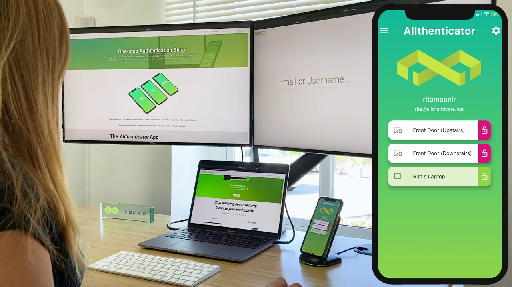

# Allthenticate

Founded in Santa Barbara, CA by UCSB alumni, [Allthenticate](https://allthenticate.net/) is a cybersecurity company that aims to revolutionize the way that people will interact with their devices. Their products enable the use of a smartphone to unlock everything, from doors to your office, to logging into a website, and even unlocking your car. 

The company has broad goals to simplify yet bolster modern network security, where anyone can be authenticated and be able to communicate securely yet easily. With ambitions set high, it’s important to be able to quantify and provide evidence of a superior product, which leads to the need for a team of data science students. 

Our capstone team consists of undergraduates Akshat Ataliwala, Calvin Jenkins, Bosco De Enrique Romeu, and Yuki Yamazaki, as well as graduate advisor Leron Reznikov. We are working directly with Founder and CEO of Allthenticate, Chad Spensky, which is incredibly exciting as we have the opportunity to shape the analytics processes of the company.

 