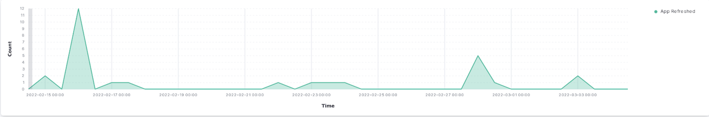
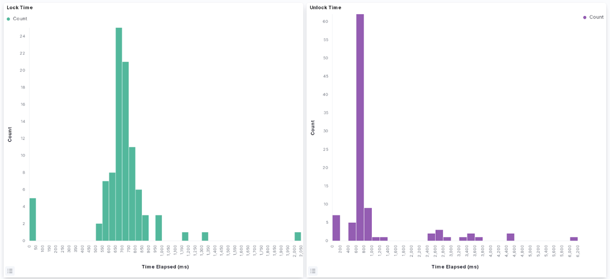

# Project Update 2 (3/4/2022)

### **Additional background**

As you may remember, Allthenticate is an app-based authenticator solution that allows users to use their phones as a central “password” for a number of different things they may need to authenticate (doors, computer, websites, etc). As a reminder, our goal in this capstone project is to 1) improve the user’s experience by determining when the app may not be functioning as intended and 2) to be able to quantify the ease of use, time saved, and security benefits compared to the traditional status quo. 

Since the first update we’ve made a lot of tangible progress, and are determined to make up any lost time that we might have experienced when getting our project up and running. We’ve finally gained access to data, which has been evolving daily. Initially, we were getting data from 3 test phones being used at Allthenticate’s offices to set up the logging infrastructure and iron out any issues in formatting of our data. However, as of late February/early March, the logging system has been pushed out to all of Allthenticate’s customers, meaning that we are now getting constantly updating data every minute of every day, from real users using the Allthenticate app. Additionally, we’ve gotten a shared repository setup on GitLab, which has allowed us to speed up the collaboration process and streamline our development process now that we reliably have access to data. 
  
In the previous update, we got some feedback advising us to explain the definitions of certain variables more clearly, something that we agreed would be helpful for not just others but ourselves as well. 

  **Table 1: Log Features**
  
|    | Field (log.*)      | Meaning                                                         | Example                              |
|---:|:-------------------|:----------------------------------------------------------------|:-------------------------------------|
|  0 | phone              | unique ID from the phone                                        | 7ca1f345-5abf-44ba-15d6-58db695e4c6a |
|  1 | timestamp          | phone time when log generated                                   | 2022-02-23 12:23:27.330722           |
|  2 | phoneModel         | model of the phone                                              | Pixel 3 XL                           |
|  3 | event_type         | type of device (1:reader, 2:computer)                           | seen / device                        |
|  4 | uuid               | BLE connection possible between phone and device                | 132f45b7-1za2-4a54-8340-468e375c480e |
|  5 | type               | type of log                                                     | 1 / 2 / NaN                          |
|  6 | locked             | device lock status                                              | True/False                           |
|  7 | connecting         | phone connecting to device                                      | True/False                           |
|  8 | connected          | BLE connection between phone and device                         | True/False                           |
|  9 | connectable        | BLE connection possible between phone and device                | True/False                           |
| 10 | communicating      | phone communicating to device                                   | True/False                           |
| 11 | processing_command | device processing command from phone                            | True/False                           |
| 12 | action             | action taken by the user                                        | nan / connect / unlock / lock        |
| 13 | time_delta         | elapsed time since last interaction b/w this phone-device combo | 0 days 00:00:04.273284

### **Initial Efforts/findings**

Since much of our logging infrastructure was still in development, we spent significant time finalizing log format and structure into something standard. This can be seen and explained by Table 1. These logs capture information about user actions in the phone app, communication between phones and devices over bluetooth, and communication between phones and computers over FCM.

We have generated several real time visualizations in the Kibana dashboard on our Elastic instance running on AWS. The first set of visualizations (Figures 1-4) show relevant real time use data for identifying issues within the application. One can infer from a spike of users opening and closing an application, turning bluetooth on and off, or refreshing the app that there is an issue with the performance of the app. Additionally, if there is a spike in messages about the phone trying to connect to local devices, there is clearly an issue on the backend of the app or device infrastructure.
  

<em>Figure 1. Count of Apps. Launched/Closed from 15.00hrs to 00.00hrs.</em>

 

<em>Figure 2. Count of Bluetooth Connections/Disconnections from 15.00hrs to 00.00hrs.</em>

 

<em>Figure 3. Count of times App is refreshed from 15.00hrs to 00.00hrs.</em>

<em>Figure 4. Device connecting to phone/ Device in range but not connecting from 15.00hrs to 00.00hrs.</em>

 

Beyond real-time visualization work, we have begun work towards generating meaningful static visualizations for deeper insights into the functionality of the company's products. This work has been somewhat slow as the updated app has yet to be deployed to all users, but we have worked to create a secure method for accessing data within a Python script using credentials that are ignored from Github commits. Figures 5 and 6 show the distribution of lock and unlock times, and can be used to identify abnormally long unlock or lock times in real time, another method for identifying issues in the company infrastructure.

  

<em>Figures 5,6. Histogram on time taken to lock/unlock a device.</em>

 

Additionally, we have created a script for cleaning and formatting the data in a structure that will allow for time series analysis, with logs divided by each unique phone ID and device ID in order of the log’s timestamp.

|    | phone                                | timestamp                  | phoneModel   | event_type   | uuid                                 |   type | locked   | connecting   | connected   | connectable   |   communicating |   processing_command |   action | time_delta             |
|---:|:-------------------------------------|:---------------------------|:-------------|:-------------|:-------------------------------------|-------:|:---------|:-------------|:------------|:--------------|----------------:|---------------------:|---------:|:-----------------------|
|  0 | 1234cf90-5d23-423b-8ffe-caddb46fb123 | 2022-03-02 09:08:11.251430 | DUB-LX0      | seen         | 123f95b7-1bb2-4a54-8340-123e375c480e |      1 | False    | False        | False       | True          |             nan |                  nan |      nan | NaT                    |
|  1 | 1234cf90-5d23-423b-8ffe-caddb46fb123 | 2022-03-02 09:08:15.524714 | DUB-LX0      | seen         | 123f95b7-1bb2-4a54-8340-123e375c480e |      1 | True     | False        | False       | True          |             nan |                  nan |      nan | 0 days 00:00:04.273284 |

### **Next Steps**

Since Update 1, we’ve finally gained access to more data, documented our feature space, worked on cleaning the raw data to make it easier to analyze, and began analyzing the user behavior data from the test phones collected by the Allthenticate app. We’ve also made initial efforts at producing several visualizations of those analyses, both in the real time and on subsets of past data. 

An immediate goal for us is to refine the visualizations we’ve created, and hopefully produce something more that can more effectively show trends among boolean values that have time series properties. For a long term goal, we’ve had an initial meeting with professors from Vanderbilt University to work on a deeper usability study. There are a lot of details regarding experimental design questions as well as determining the narrative, purpose, and goal of our research that needed to be discussed with Chad and the professors we are working with.  

For spring quarter, we plan to focus our efforts in order to make up for the delay of the acquisition of the data. As mentioned previously, we hope to utilize our analyses to improve the app’s user experience and reach our ultimate goal of having an academic publication to report our findings.
