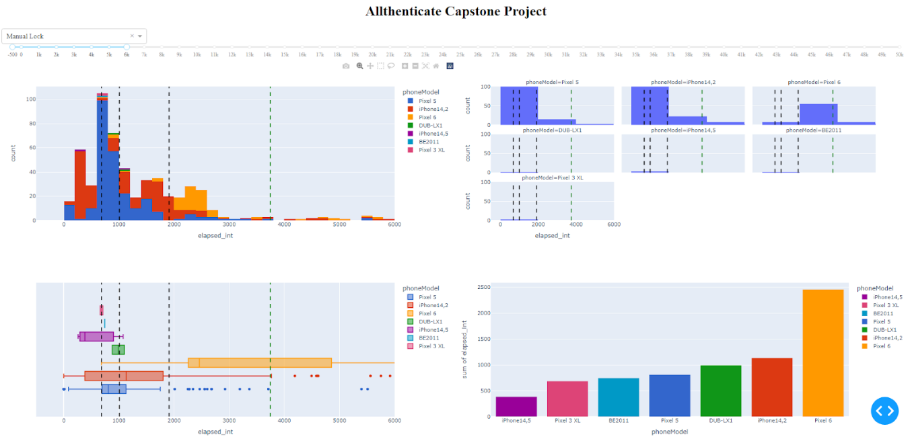

# Project Update 3 (5/2/2022)

### **Initial Goals/Methods**

As the quarter began and we sat down to refocus/refine our goals for the second half of the project, it became apparent that our initial goals were too broad in some respects. Upon reflecting on what we realistically could accomplish in the next 10 weeks, we decided to focus on 1) generating metrics that could give Allthenticate insights on their customer app data and 2) getting started on experimental design for a usability study that the company wants to do in the near future. 

Still, the early week or two of the quarter was slow to start, as the team was having COVID-19 troubles, and we were still unsure as to how exactly we wanted to generate our metrics. Previously, we were using plots auto-generated through the logging infrastructure setup, but none of it was truly written by us, so it felt restrictive in the choices we could make as data scientists. We began working on our python implementation of these metrics, and now that we had a reliable data pre-processing pipeline from the last update, we were able to work with the data more effectively. Initial efforts included using libraries like matplotlib and seaborn for visualizations, but none were as dynamic as Plotly, which ultimately became the tool of choice as it had the interactive capability built in and was extremely intuitive to interact with our data.

### **Progress/Findings**

In the last update, we were split between two separate types of visualization: live metrics and static distributional ones. While we were and still are able to generate both, it became that they would be far more effective if we were able to develop some sort of tool that Allthenticate could use to combine them into one. This led us to the idea of building a dashboard that would take care of both visualizations tasks as well as give us a deliverable tool for the company to use. This is where plotly really shines, because on top of its interactive visualization style, we were able to work with Plotly Dash to build this dashboard. Dash is a plotly framework that allows users to build web apps and dashboards, so any visuals we generate with Plotly are immediately compatible with Dash and easy to implement. Essentially, this allows us to put Python-based analytics in the hands of business analysts, marketing teams, or even backend engineers, which is extremely powerful for a long term solution. As our data evolves and new questions arise, the company will easily be able to integrate visualizations for them into the dashboard without much effort. 

With Dash, we hope to include metrics like total users, total time saved, average lock/unlock time, as well as histograms, box plots, barcharts, and pie charts, of lock/unlock/connection times as well as heatmaps of connection patterns. The main goal of including so many different plots is to 1) get a general overview of the data and the strength of the product that Allthenticate is actually offering and 2) to be able to easily identify outliers and instances where the app is not working correctly. Boxplots and histograms would easily identify outliers within data, and an incorrect looking connection pattern could be very telling of an issue that needs to be fixed. One of the big aims of this project is to improve user experience and Allthenticate’s app as a whole, so finding instances where its not performing as expected through logs would be incredibly valuable to the company. 

<em>Figure 1. New dashboard layout with visualizations.</em>

 

<em>Figure 2. Selection dropdown for metrics currently tracked by dashboard.</em>

 

Here is a first draft of our dash app, with a histogram, faceted histogram, boxplot, barchart and pie chart (not pictured). There is a drop down at the top for different metrics, as well as an x-axis slider to make it easy to see the main distribution as well as zoom out and see large outliers. The added lines (in order) are 25th percentile, 50th percentile / median, 75th percentile, and 75th percentile + 1.5(IQR), which we’ve used as a measure for outliers. 

We also have been taking steps toward our goal of publishing an academic paper regarding user happiness of the Allthenticate app. In order to gain more objective insight on how the users feel about the usage of the product, we came up with several questions. The questions are split into three categories: screening questions, in-test questions, and post-test questions. The screening questions will allow us to see what kind of people were testing out the app, while the in-test questions will give feedback on the actual usage of it. The post-test questions give us opinions we can use for future reference. Here are some summary questions, but feel free to check out our survey! (https://forms.gle/imj51aY34RXUMrr17)

<em>Figure 3. Example of survey questions for usability study.</em>

If we end up deploying the survey to a relatively high number of users, the survey will provide very powerful feedback on the performance of the app/user satisfaction we can use as a “target variable” for our dataset. More on this in the next steps.

### **Next Steps**

In the coming weeks, we want to add the app versions into our logs so that we can differentiate between a new customer problem and an issue for which a fix has already been released. Having app version in our data will also allow us to filter our visualizations on our dashboard by app-version, which would give us better insights on how Allthenticate is improving with each update, and not just on a cumulative distributional level as it is right now. Additionally, we want to be able to differentiate performance by the operating system currently running on the phone, so we will be adding that to the logs as well. Along the same lines, we want our dashboard to be able to give users a time frame they want to see data from (past 7-days, past 30 days, etc), which combined with app-version would be an incredibly powerful tool that Allthenticate can use to see improvements in their product as well as problem instances as they arise. 

Another course of action we have in mind to be able to improve the product is to perform cluster analysis. As introduced in previous posts, we have extracted different variables from the logging dataset (e.g. connection time). Our idea is to, after the clustering is done, analyze these variables within the clusters (e.g. average connection time) to be able to target specific profiles that are having either lots of problems with the app or a very pleasant experience with Allthenticate. However, clustering is an unsupervised learning technique, so it is sometimes difficult to assess the correctness of the results. This is where the feedback of the survey comes into play and why we described it as a “target variable”. If we have survey answers for most of the users (say around 70-90% of the total users), we can (on top of analyzing the statistics of the attributes we extracted within the clusters) analyze the survey results within the clusters. The survey includes 21 questions, but there are two in particular (included in the post-test section) we could use as target variables:

* Rate Allthenticate from 0 to 10 without considering any malfunctioning you've experienced, e.g. low connection time, BLE problems (rate the concept itself)
* Rate Allthenticate from 0 to 10 considering malfunctioning problems you may have experienced, e.g. low connection time, BLE problems

Another big goal for us is to push the logging to all users, as currently it's only active on test phones in the office. The main roadblock here is getting SSL working so that customer data is secure, but this is close to being implemented and will turn our 6-7 user dataset into 100’s of users, which might give us additional challenges with visualization that we want to tackle. SSL security has been implemented within the phone app and our server that records the logs, and is currently blocked by the backend system used to forward the logs to our database. The addition of more users will present new challenges, as the number of logs generated will likely be in the hundreds of thousands weekly. To preempt the strain this puts on our current data pipeline, we are aiming to have our dashboard and graphing code run on a more powerful server continuously.

Our overarching plan is to eventually integrate our dashboard into an Allthenticate employee portal that can allow employees to look at the company’s data, whether it be for marketing, business analysis, or bug-fixing purposes. 
