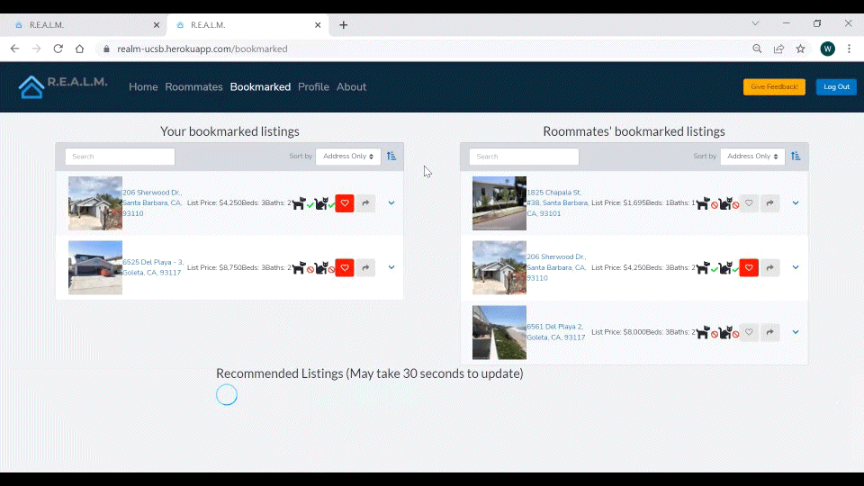

# Creating a Simple Model #

## A Concise Refresher ##

### About the Project

Our project aims to create a recommender system that recommends properties to users based on previous user interactions and property features. Our final goal is to integrate our model into the [Santa Barbara property website](https://realm-ucsb.herokuapp.com/) created by UC Santa Barbara’s AppFolio sponsored computer science capstone team.

### Where we left off

Our initial post gave a brief introduction of our project, the data we are working with, our obstacles, a brief overview of the model we were interested in using, and how we were working towards understanding the BiLateral Variational Autoencoder. 

Our main struggle with the data was working around the many null values in the item_features dataset. Since then, we have opted to focus on the ratings dataset for the simple model we created for the CS Capstone team, and plan to utilize the item_features dataset in future works.

In terms of the model, we have been able to understand the complexity of the Variational Autoencoder and were able to create a model trained on user interaction data with Santa Barbara County properties to provide to the CS capstone team. 

In the following sections, we will go more in depth on the model we are using, hyperparameter tuning, baseline models that we used to compare to our chosen model, metrics we are using to measure the performance of our model, and our future plans to improve our model. 

## Our Model ##

*Figure 1. Recommender System Overview*

Recommender systems are algorithms aimed at suggesting relevant items to users. There are two main types of methods of recommendation, collaborative filtering methods and content based methods.

Content based methods build a model, based on features of user and/or items, that explain the observed user-item interactions. Recommendations can therefore be done by knowing the features of a new user and/or item.

Collaborative methods for recommender systems are methods that are based solely on the past interactions recorded between users and items in order to produce new recommendations. These interactions form the user-item rating matrix.

*Figure 2. Collaborative Filtering Using Interaction Matrices*

The goal is to use these past user-item interactions to detect similar users and/or similar items and make predictions based on these similarities.

### Autoencoder Architecture ###

*Figure 3. Autoencoder Structure*

A popular model used for collaborative filtering are autoencoders. Autoencoders are an unsupervised learning technique that leverages neural networks for the task of representation learning. It’s designed as a neural network architecture that imposes a bottleneck in the network which forces a compressed knowledge representation of the original input. This is done by creating a supervised learning problem tasked with outputting x’, a reconstruction of the original input x. The input x is fed into a neural network encoder that outputs z , a compressed lower dimensional representation of the input. Z is then used as input to the neural network decoder and attempts to reconstruct the original input x.

In the context of recommendation systems, user and/or item rating vectors can be used as input for an autoencoder and allows us to . Due to compression and reconstruction error, our reconstructed rating vectors can be used to give new recommendations based on the highest rated interactions that weren’t in our original input. 

### Variational Autoencoder Architecture ###

An issue with regular autoencoders is that it is limited by the encoder network outputting a single value for each encoding dimension. Variational Autoencoders (VAE) solve this problem by representing each latent feature as a probability distribution. When decoding from the latent dimension, the VAE will randomly sample from each latent feature distribution to generate a vector as input for our decoder model.

*Figure 4. Variational Autoencoder Structure*

For recommender systems, this can be replicated by our encoders outputting one latent dimension vector of means and one latent dimension vector of standard deviations for each latent feature. These latent parameters can then be sampled from using a gaussian distribution. User or item rating vectors that are nearby to one another in their latent parameter space should correspond with similar reconstructions. This allows VAE to learn smooth latent state representations of our user/item rating interaction data which can be used generatively for recommendations.

### Bilateral Variational Autoencoder Architecture

*Figure 5. Bilateral Variational Autoencoder Structure*

Variational autoencoders are limited in using either item rating vectors or user rating vectors for input. This results in loss of information of user-item affinities. Bilateral Variational Autoencoder Architecture (BiVAE) allows us to work with dyadic data and retain all information. The BiVAE architecture consists of two VAEs used conjointly, one using item rating vectors as input and the other using user rating vectors as input.   Each one is trained separately by encoding its input and outputting its latent feature distributions. Then both  its latent feature distribution for one input and  the other VAE’s resulting item/user latent representation for the entire user-item rating matrix are taken as an inner product for the decoder. In addition to no loss of user-item information, BiVAE allows us to make user and item based recommendations.

### Multimodality Using Constrained Adaptive Priors

*Figure 6. Constrained Adaptive Prior Implementation*

Another benefit of BiVAEs are their capability to incorporate user/item features in their recommendations by using constrained adaptive priors (CAP). CAPs are used by adding multimodality in by integrating user/item features information into the latent representations that are ultimately sampled from to use as input for the decoder. User/item features are encoded into the same dimensional space as the latent representations and then used as a constraint in a multivariate gaussian distribution with its mean being the sampled user/item latent representation.This final multivariate gaussian distribution is used for sampling for our input for the decoder.

CAPs allow us to incorporate various information about properties (e.g. price, location, sq. footage, etc) and users (e.g. family, location, etc.)  to make more informed recommendations. Another benefit is that new users/items with few interactions can also be given more accurate recommendations using their prior information. The capabilities and great tested performance of Bilateral Variational autoencoders make it a perfect model for our recommendation system goals.

## Data Cleaning ##

A major component to the BiVaE model is incorporation of item features. While the low dimensionality and completeness of our user dataset posed few obstacles, the higher dimensionality and various null observations in the items dataset is something that we continue to work around. Further, some of the data in our features is nested within JSON keys that include additional data, which is something we’ve worked to extract into separate columns. However, these extra features tend to have a high rate of null values, and part of our experimentation is based on how to incorporate or not incorporate the data we have.

We have currently only implemented location as user/item features for our model’s CAPs. We anticipate that we will have to experiment with multiple options, whether it be including only subsets of the features or imputing the data we don’t have records for, to yield our most desirable results. 

## Metrics ##

Several approaches for evaluating model performance are demonstrated along with their respective metrics. Rating metrics, ranking metrics, classification metrics and non accuracy based metrics are some of the examples. In our projects we mostly focused on the ranking metrics. The use of the Ranking metrics in the model is that they evaluate how relevant and effective recommendations are for the users. In general the more relevant an item is, the more likely we’ll want to predict it. Precision and recall are some of the most simple and easy to interpret metrics available to us. For our purposes, we are dealing with a recommendation system model and will define these metrics under this consideration.

We use precision to measure the proportion of recommended items that are relevant. And we used recall to measure the proportion of relevant items that are recommended. Another metric that we looked at is normalized discounted cumulative gain (NDCG) which evaluates how well the predicted items for a user are ranked based on relevance. Also we looked at mean average precision (MAP) which means it is the average precision for each user normalized over all users. The last thing that we looked at is the area under curve (AUC) which is the area under the receiver operating characteristic curve.

## Hyperparameter Tuning ##

For this project, we are implementing Grid Search and Random Search to help us determine the best hyperparameters to use in our model based on the training data. First, we hyperparameter tuned the data to include only Santa Barbara properties, which consists of only about 9500 observations. Because of this smaller dataset, we opted to use Grid Search since it searches through every possible combination of hyperparameters passed through the function into the model. When we move up to a larger dataset, and need to account for a larger region like all of Southern California or possibly the entire country, we would need to use Random Search to obtain a random sample of the possible combinations. This is purely because of the larger dataset and the lack of powerful computational power to iterate through all the possible combinations. 

For now, since we focused on preparing a better model for Appfolio’s CS Capstone which only contains Santa Barbara Counties, tuning on just the Santa Barbara Counties was our best bet. 

The hyperparameters we tuned are latent dimension size, encoder architecture, activation function, likelihood, number of epochs, batch size, learning rate, and beta KL divergence term. The metric we want to look at is Mean Average Precision (MAP). MAP is a measure that takes in a ranked list of your recommendations and compares it to a list of the true set of relevant recommendations for that user. MAP rewards you for having many correct relevant recommendations in your list, and rewards you for putting the relevant recommendations at the top (you are also penalized more when incorrect guesses are higher up in the ranking). Therefore MAP is the best measure for overall recommendation system performance for our purposes. Since we are experimenting with multimodality, we tune for two different models, one including Constraint Adaptive Priors and another without. At the moment, the only feature we’ve included for multimodality is geographic location by longitude and latitude. 

*Figure 7. Testing Results for the best model for no Constraint Adaptive Prior.*

*Figure 8. Testing Results for the best model with Constraint Adaptive Prior.*

Above are the results from running the experiment and applying the best models to the testing data. Since we are looking at comparing the models using the Mean Average Precision, we see that metric increasing slightly when we add features using Constraint Adaptive Priors. 

## Results ##

We used a baseline model for comparison. In general we wanted to see if our model is actually performing well. So we compared the accuracy of our model with the accuracy of the baseline models to see if we improved upon it. We chose a collection of various popular recommender system algorithms (e.g. linear, non-linear, factorization based, neural network based, etc.) as our baseline models. The baseline models that we used in our projects are variational autoencoder (VAECF), poisson factorization (PF), hierarchical poisson factorization (HPF), Bayesian Personalized Ranking (BPR), Generalized Matrix Factorization (GMF), Multilayer Perceptron (MLP), and neural matrix factorization (NeuMF).

*Figure 9. Resulting Metrics from Baseline Models and BiVae.*

From the results, we can see that our bilateral variational autoencoder with constrained adaptive priors outperformed all models in all metrics and specifically our most important metric, MAP.

## Future Goals ##
After meeting our goal for the end of this quarter, which was  implementing a simple recommendation model in the CS capstone, we look forward to improving our current model by incorporating multimodality. By incorporating multimodality, we would be looking at different features to use like latitude, longitude, property type, prices and images. In addition, we would still take time to test other models if we can achieve a better performance than the current model on the website. 

Although the CS Capstone website is showing only properties in Santa Barbara County, we would like to see if we can build a model that can be applied to a larger geographic area, like all of California or the entire country. 

*Figure 10. How to Get Recommendations from the CS Capstone Website.*
