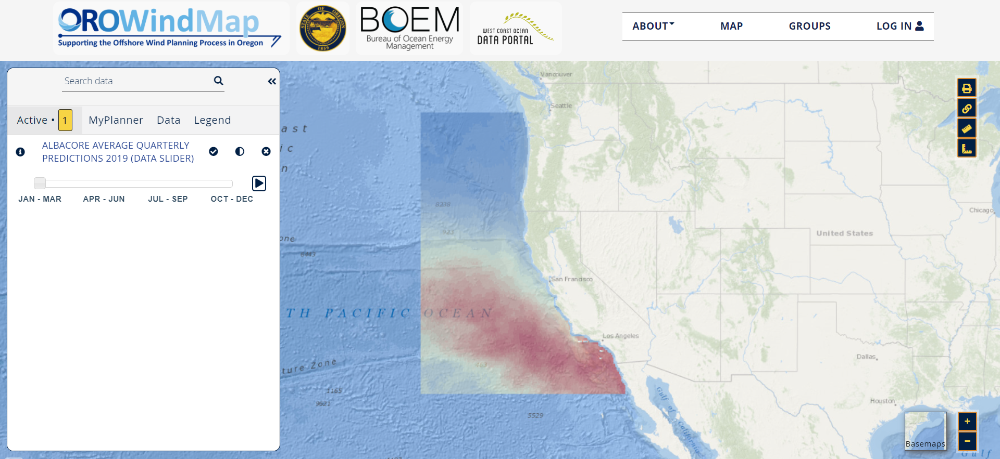

# CalCOFI Initial Progress and Goal Definition

## Project Overview 

For our project we are working with California Cooperative Oceanic Fisheries Investigations (CalCOFI), a research organization studying and protecting the environment off the California Coast. The organization has been collecting data on oceanic properties (involving physical, chemical, and biological data) like temperature, salinity, oxygen, and pH down to a depth of about 500 meters for the past 74 years. CalCOFI measures these properties by conducting cruises out to stations throughout 500 miles of the coastline and 360 miles offshore. 
  
 Observations made by CalCOFI’s data collection program reflect that the dissolved oxygen (hypoxia) and pH levels in the ocean off the coast of California have been varying greatly over the past few decades. It is increasingly recognized that low dissolved oxygen and low pH conditions have detritus effects on marine organisms. These phenomena occur naturally in certain coastal environments and can be applied by the effects of climate change and global warming. Thus, our project is focused on conducting exploratory analysis to characterize the regions of the ocean off the coast of California in which ocean acidification and hypoxia vary to dangerous levels and thus where marine life may be more susceptible to climate change. Our goal is to present our analytical findings through easily digestible visualizations and animations to help policy makers understand where local interventions need to be implemented and what those interventions would need to address.
  
Our team is currently working with visualizations in R using leaflet and shiny, and some other support packages like mapbox. These methods will help us visualize the spatio-temporal data that CalCOFI takes, and make variations in oxygen saturation, pH, and other ocean properties easier to capture. We are currently working towards a visualization of the bathymetry of the coast of california, and how oxygen varies with depth in various regions. The end goal would be to create a sort of animation where the change in oxygen over the various seasons throughout the year can be seen on the map. We are essentially creating a 4D map of the California Coastline. The image shown below illustrates what we are trying to go for, with the data overlaid on a map, and the interactive component where we can see the data change over seasons.

<figure>
    
    <figcaption>Visualization of 4D geospatial data. Image obtained from <a href='https://offshorewind.westcoastoceans.org/visualize/#x=-126.30&y=38.43&z=4.787070098064209&logo=true&controls=true&dls%5B%5D=true&dls%5B%5D=0.5&dls%5B%5D=397&basemap=ocean&themes%5Bids%5D%5B%5D=4&tab=active&legends=false&layers=true'> OROWindmap Data Portal</a><figcaption>
<figure> 

## Data Collection:
CalCOFI is a project that has been runing for a long time, and as a result their data collection methods follow closely with protocol to maintain consistency over the many years the project has been running. Data is taken 4 times a year (once a quarter). A ship takes scientists out to the same set of coordinates every year. At those coordinates, a CTD Rosette (pictured below) is lowered into the water, and at set discrete depths, ocean water samples are taken. Many parameters are measured with the samples taken such as Oxygen concentration, pH, salinity, temperature etc. Because of the size of the dataset, for development purposes we have cut down on the time range we are looking at to the years **2000-2021**.
<figure>
    
    <figcaption>CTD Rosette Bottles used to Sample Oceanwater<figcaption>
<figure>
<figure>
    
    <figcaption>Visual representation of sampling method used by CalCOFI. We are working with the Bottle data samples shown with the dark blue dots.<figcaption>
<figure>   

## Data definitions
We also cut down on the parameters used partly for development purposes, partly because we are only interested in certain parameters as of right now. The table below represents the parameters we use, and what they represent:
| **Field Name** | **Units**                | **Description**                                                                                                                                                          |   |
|----------------|--------------------------|--------------------------------------------------------------------------------------------------------------------------------------------------------------------------|---|
| Cst_Cnt        | n.a.                     | Cast Count - All CalCOFI casts ever conducted, consecutively numbered                                                                                                    |   |
| Btl_Cnt        | n.a.                     | Bottle Count - All CalCOFI bottles ever sampled, consecutively numbered                                                                                                |   |
| Sta_ID         | n.a.                     | Line and Station [Line] [Station]                                                                                                                                        |   |
| Depth_ID       | n.a.                     | Uses the Cast_ID prefix ([Century]-[Year][Month][ShipCode]-[CastType][Julian Day]-[CastTime]-[Line][Sta]) but adds three additional variables: [Depth][Bottle]-[Rec_Ind] |   |
| Depthm         | meters                   | Bottle depth in meters                                                                                                                                                   |   |
| T_degC         | degrees Celsius          | Water temperature in degrees Celsius                                                                                                                                     |   |
| Salnty         | Practical Salinity Scale | Salinity (Practical Salinity Scale 1978)                                                                                                                                 |   |
| O2ml_L         | milliliters per liter    | Milliliters oxygen per liter of seawater                                                                                                                                 |   |
| R_Depth        | meters                   | Reported Depth (from pressure) in meters                                                                                                                                 |   |
| pH1            | pH scale                 | pH (the degree of acidity/alkalinity of a solution)                                                                                                                      |   |
| pH2            | pH scale                 | pH (the degree of acidity/alkalinity of a solution) on a replicate sample                                                                                                |   |
| Cruise_ID  | n.a.            | Cruise identifier [Year]-[Month]-[Day]-C-[Ship Code]                                             |
| Cruise     | n.a.            | Cruise Name [Year][Month]                                                                        |
| Cruz_Sta   | n.a.            | Cruise Name and Station [Year][Month][Line][Station]                                             |
| Cast_ID    | n.a.            | Cast Identifier [Century] - [YY][MM][ShipCode] - [CastType][Julian Day] - [CastTime]-[Line][Sta] |
| Sta_ID     | n.a.            | Line and Station                                                                                 |
| Quarter    | n.a.            | Quarter of the year                                                                              |
| Date       | time            | Date (Month Day Year)                                                                            |
| Year       | n.a.            | Year                                                                                             |
| Month      | n.a.            | Month                                                                                            |
| Lat_Dec    | decimal degrees | Observed Latitude in decimal degrees                                                             |
| Lon_Dec    | decimal degrees | Observed Longitude in decimal degrees                                                            |
| St_Line    | n.a.            | Nearest Standard Line                                                                            |

## Current Goals

Our main objective of the project at this point focuses on conducting exploratory analysis through visualization techniques to illustrate hypoxia in the Pacific Ocean off of California’s coast. Some specific goals we are working on include comparing the variability of hypoxia at set depths for each season and viewing the change among average hypoxia levels over time since 2000. Currently, we are implementing packages in R that have static and interactive capabilities such as ggplot and leaflet, to hopefully create an interactive medium that allows viewers to easily look up information from points on a map where the stations travel to collect bottle and cast data. 

