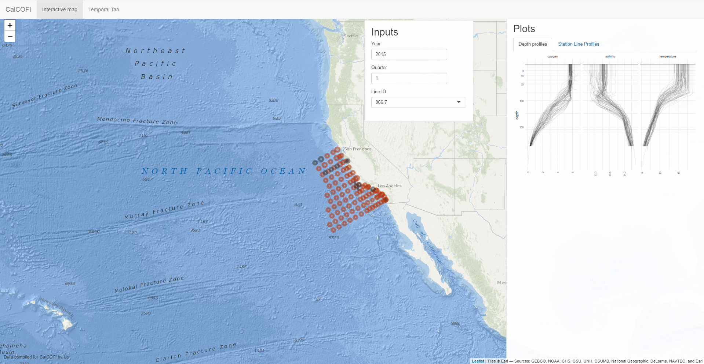
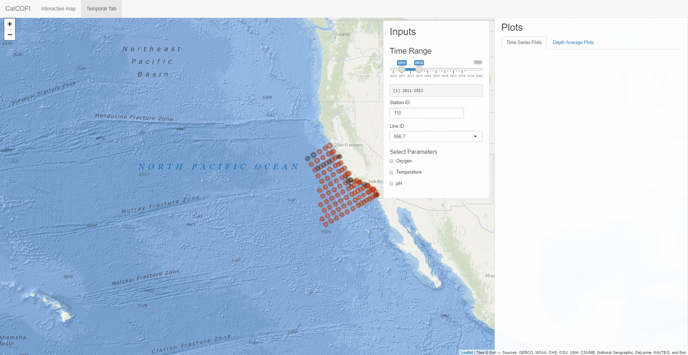
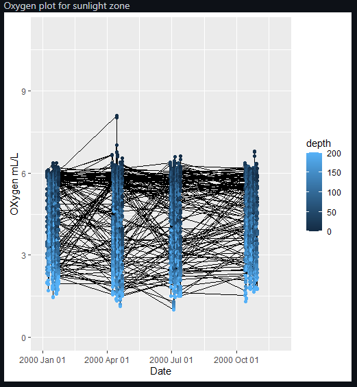

## The Final Stretch

### Project Goal Reframing
Over the past month, we have clarified what the final data product would look like. Our application will have two components: one tab showing spatial variation, and one tab showing temporal variation. This would allow both us and users to reduce the dimensionality of the data from CalCOFI. We also want to display all of the parameters on the application in the same way we are displaying time. Finally, we would also like to demonstrate the importance of having such long-term data samples by finding and highlighting trends in the data, and possibly connecting them to real-life case studies.
We have also decided on a definition for Hypoxia: anything lower than 1.4 ml/L oxygen levels will be decidedly hypoxic. At lower depths however, water is normally hypoxic since oxygen has no easy way to circulate to the bottom of the ocean. These regions are naturally hypoxic, so these are not the anomaly regions that we are interested in. We need to combine this definition with the time-series data to be able to find anomalies. We hope to generalize this to other parameters to see if these anomalies are related, and whether there are real case studies we can connect to these phenomena.
In the end, we should have an application that can be used by the general public to get an idea of what Hypoxia is and why it’s important, but also can be used by researchers interested in the data to have a better understanding of it. Developing such an app is what we have been working on this past month.
Where have the team’s efforts been focused in the last month? Have you been working on a specific analysis? Fitting models? Training a predictive tool? Developing a code product? Working out some kinks in your pipelines? Try to give a brief summary of your team’s major efforts and explain how they relate to project objectives.

### Shiny App
The purpose of the shiny application is for users to visualize the data that CalCOFI produces in a way that can clearly show the goals of taking such long-term, multivariate data. Splitting the shiny application into spatial and temporal tabs allows users to adjust one thing at a time, while viewing the full spatial or temporal variation of parameters like oxygen, pH, or temperature. To achieve this, we choose which inputs we present on each page. On the spatial page, users are able to choose which year, quarter, and station line they want to look at, and we display a maximum of spatial data for the given time period. This means we display the full depth range for a given station line.Similarly, for the temporal page, we provide inputs for depth, station, station line, and a time range slider. Then we display time-series data of the chosen parameters at that given depth. We also hope to show an animation of station sampling patterns over the years, with annotations indicating why some stations were sampled and some weren’t.
While building the application, a problem we ran into was that shiny doesn’t allow duplication of functions such as map rendering or plot outputs. This meant that duplicating the spatial tab layout for the temporal tab was not as straightforward as we would have hoped, and took more time than we would have hoped. We solved this issue by making two separate functions for the map to render on the second tab. The layout then was preserved, and the map output was rendered. Another issue we came across was that if we are having the same inputs across the two pages, the map would actually be altered in both tabs.

<figure width="200">
	
	<figcaption>Figure 1. Screenshot from dashboard. Inputs provided are time and some space, so that a maximum amount of spatial data can be displayed.<figcaption>
<figure>

<figure>
	
	<figcaption>Figure 2. Screenshot from dashboard. Inputs provided are space and some time, so that a maximum amount of temporal data can be displayed.<figcaption>
<figure>

### Spatial Data
During the past few weeks we have also been digging into the structure of spatial data in R in order to add station lines that connect our station points on the map. Spatial data structure will also be important for interpolation in the future. R provides two packages, SP and SF, with varying structures for spatial data. Both packages require a bounding box, the maximum and minimum coordinates of the feature, and a Coordinate Reference System (CRS), the type of map projection for the feature. However both of these packages store the bounding box and CRS differently. 
The SP package stores the bounding box and CRS in two slots and holds the coordinates as a matrix. Other attributes and ID’s can then be added as additional slots. The SF package is a data frame that works mainly with list-columns. The list-column holds a list of the coordinates for each row and then a second list-column holds the bounding box, CRS, and other attributes. The SF package is more conducive to altering existing data frames because of its pre-existing data frame structure. 
To meet our goals, we used the SF package and turned our Bottle data frame into an SF dataframe by creating a list-column of all the coordinates for each station line number. After this we could transform the data frame into an SF data frame by using a function that adds a bounding box and CRS. The new data frame could then be used to add lines onto the leaflet map. 

### Data Visualization Methods
The goal with data visualization is for the user to be able to quickly identify anomalies, and trends, and also to be able to see all of the data in a better format than a table. The better format we chose was to divide the data into spatial and temporal, and display them on different pages in the app. The spatial page has the two plots we have talked about before:
Station-line slice plots. Where you can see what the variation of a parameter along the full depth of a full station line is
Ponytail plots. Where you can identify a station, and follow the variation of a parameter along the full depth of one station.
The temporal tab will have plots that will show how the data varies over time. To achieve this we make two plots: a time series data plot, and a depth average plot.
Thus far, we’ve created very minimal time series plots to show how temperature and oxygen change over periods of time. Currently, these messy plots show the range of each feature for all depths and stations. Our end goal is to have user input determine which station line to select as well as depth range to view time series plots for oxygen and temperature. Currently, we are working on getting averages for temperature and binning depths so that we can have multiple lines representing different depth ranges on the same plot.
<figure>
	
	<figcaption>Figure 3. A preliminary version of the timer series plot to go on the temporal tab.<figcaption>
<figure>

The depth average plot is planned to be a plot of the average value of a parameter, over a given period of time, with error bars representing the maximum and minimum of that value in that time. Then, another plot of the selected year’s values will be overlaid onto the first plot to show whether the measurements for that year are above or below average.
The problem with both of the plots is that often times, we are missing data from certain quarters because certain stations may not be sampled some quarters. We are working on finding a solution to this. Another problem we foresee is marrying the very different resolutions of depth and lat-lon data. The depth measurement intervals are much smaller than the station intervals, so we should be careful interpreting data going forward.
One last plot we hope to be able to do is spatial interpolation of the data across stations. This would involve using the spatial data structure formed for plotting station lines, and a method called kriging, which is a method of Gaussian Process Regression for spatial data.

### Looking Ahead
To wrap up the project, we are working to finish the plots mentioned above to be able to fit that into our final shiny layout. To keep things simple, we are also looking at finding and highlighting anomalies in our data that may be telling about the climate. Using these numbers will support our overarching story of the data. This narrative should be able to demonstrate the value of the information that CalCOFI produces, and should serve as a quick introduction to the trends and patterns in the data. The story the data will hopefully tell is one about what effect hypoxia has on the environment, and possible causes of it. This would be done by finding case studies to highlight, to which we can connect our data. Another thing that would help tell our data story is an animation of the sampling patterns across the years that CalCOFI has existed, with annotations as to why some stations were sampled and why some weren’t.
