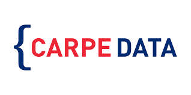

---
output:
  pdf_document: default
  html_document: default
---
# carpedata

Carpe Data is an insurance technology company whose headquarters is located in Santa Barbara, California. Carpe Data gathers and analyzes data from sources such as social media platforms and web content in order to provide insurance companies with data solutions. Insurance companies typically receive a significant amount of claims each year; Carpe Data helps to reduce the amount of manual inspection needed to verify these claims through the use of their algorithms. 

Our capstone team’s project focuses on building machine learning models in Python that predict whether or not a web page contains evidence about a fraud claim and provide information about the specific type of fraudulent activity that is present.

Our project sponsors are Crystal Zhang and Kevin Neal from Carpe Data. Our mentor is Joshua Bang, and our team members are Tyler Chia, Anum Damani, Annie Huang, Alex Rudolph, and Rithvik Vobbilisetty.
