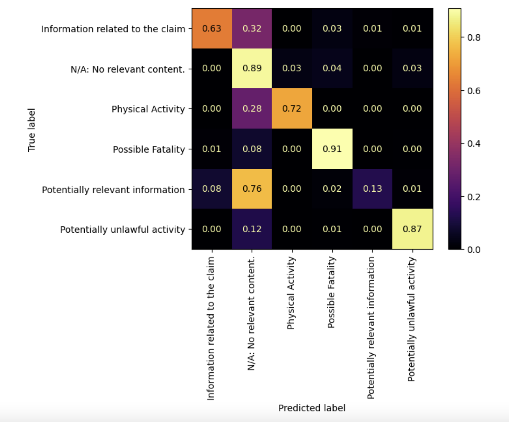

# Update 1 - (2/4/22)
******

## INTRODUCTION & GOALS

Carpe Data is an insurance technology company whose headquarters is located in Santa Barbara, California. Carpe Data gathers and analyzes data from sources such as social media platforms and web content in order to provide insurance companies with data solutions. Insurance companies typically receive a significant amount of claims each year; Carpe Data helps to reduce the amount of manual inspection needed to verify these claims through the use of their algorithms. Our team’s project focuses on building machine learning models in Python that predict whether or not a web page contains evidence about a fraud claim and provide information about the specific type of fraudulent activity that is present.

******

## SUMMARY OF THE DATA

In terms of the data, Carpe Data was able to provide us with two different datasets. The first had a size of 5.17 GB and the second was about 400 MB. These original datasets each contained 5 columns: 
- Search Transaction ID
- Search Subject ID
- Original URL
- Raw HTML text from the website
- Type of Fraud

We decided to drop the first three columns as they are not relevant to the building of our model, which left us with the HTML text along with the type of fraud associated with it as our labels. As a preprocessing step, we looked into the value counts for each unique label so that we could decide how to consolidate groups with lower frequencies. Originally there were 12 unique labels. We decided to remove all the types of fraud that had under 10 observations and then mapped the remaining ones that had under 100 observations to fraud labeled as “potentially relevant information.” This left us with 6 unique labels: 
- N/A: No relevant content
- Possible Fatality
- Potentially unlawful activity
- Physical Activity
- Information related to the claim
- Potentially relevant information

    </img>  
    <em>Figure 1. HTML feature labels with their respective counts.</em>

 

This is something that we may need to potentially revisit and regroup the labels as our sponsors may want us to include some of the labels that had under 100 observations instead of simply combining them into one label. After consolidating the labels, we concatenated the two different datasets into one, resulting in us having one large dataset containing 42,485 rows and 2 columns. From there we were able to begin the cleaning process of the raw HTML text.  

******

## PROGRESS

### Cleaning
Our team tried out a variety of cleaning methods for the raw HTML text data, but we were able to settle on one cleaning pipeline for now. First, we ran each observation through Beautiful Soup, pulling all the content data away from the HTML code formatting. Next, we removed all the links and non-breaking spaces (which were formatted as ‘&nbsp’ in the text data) from the text. Then, we normalized the unicode of the text, removed all non-alphanumeric symbols, and made the text all lowercase.

From there, we tokenized the text using spaCy and removed all punctuation, ‘stopwords’ (words that don’t contain much meaningful content), and words that contained less than 2 letters. Finally, we lemmatized the words, reducing them to their non-inflected forms. Since we weren’t sure about the performance between lemmatization and stemming on this dataset, we created another dataset where we stemmed the words instead. At this point, our text data was clean and ready to be worked with.

To set up our data so that it would be ready for modeling, we set up a train-test split with the testing set of 20% of our cleaned data. Then, we created a bag of words containing the vocabulary words and count measures of said words in our training data and created a count vectorizer. Using that vectorizer, we transformed the training set and testing set, allowing us to begin the model classification process.

Due to the fact that our dataset contains observations labeled across at least 6 categories, we would be considering all the supervised multi-class classification models. In addition, our sponsors noted that our model accuracy should balance both precision and recall across all label categories (with a slight preference for recall), so that would be our criteria for selecting our best model.

### Logistic Regression
The first model that we attempted was created from multinomial logistic regression. The multinomial logistic regression models (for the dataset with the lemmatized words and the dataset with the stemmed words) had decent performance overall; it correctly classified most of the labels with high accuracy, but since “Information related to the claim” and “Potentially relevant information” had low predictive accuracy and there is a high rate of false positives, this model is not the best.

For both stemmed and lemmatized datasets:
- Precision: 83%
- Recall: 84%
- Total Accuracy: 84%

### Naive Bayes
The second model that we attempted was created from a Naive Bayes classifier. Overall, the Naive Bayes models (for the dataset with the lemmatized words and the dataset with the stemmed words) performed poorly. The confusion matrices for this type of model revealed that many labels were incorrectly classified.

For stemmed dataset:
- Precision: 70%
- Recall: 65%
- Total Accuracy: 65%

For lemmatized dataset:
- Precision: 71%
- Recall: 66%
- Total Accuracy: 66%

### Support Vector Machine
The third model that we attempted to create was from a support-vector machine (SVM). The SVM models (for the dataset with the lemmatized words and the dataset with the stemmed words) showed the best performance out of the three models. The confusion matrices revealed that although many of the labels were classified with high accuracy, there were some labels that were misclassified. For the SVM model that was created with the dataset with stemmed words, we see several commission errors (false positives).

For both stemmed and lemmatized datasets:
- Precision: 85%
- Recall: 85%
- Total Accuracy: 85%

<em>Figure 2. Confusion matrix of the results of the SVM model using stemming and the tf-idf vectorizer.</em>

 

******

## CHALLENGES & FUTURE WORK

Throughout our initial exploratory analysis, data cleaning, and modeling process, we encountered a couple potential challenges. For example, we first had difficulty determining what the best combination of methods would be for the ‘best’ cleaning pipeline. Through removing stop words, 2-character words, lemmatization and stemming, we were worried that we might be overfiltering the data from crucial information that the model needed.

Furthermore, we wanted to provide the model with bigrams instead of unigrams, but were concerned that the modeling pipeline would take too much processing time and power if there was too much information. For reference, unigrams refers to splitting the text based on each individual word while bigrams refers to splitting the text based on pairs of words. The benefit of using bigrams over unigrams is that bigrams often capture the meaning of the text better than unigrams do. For example the bigram “not happy” captures a different meaning than the two unigrams “not” and “happy.”

As of now, we decided to stick with using unigrams when vectorizing the text after cleaning. Since we are just starting out with the building of our models, we have decided to not use bigrams just yet. However, this is something we eventually want to get around to attempting as utilizing bigrams could have a significant impact on the accuracy of our models. One issue with using bigrams that we can see is a computational one. Using unigrams in our vectorization, we have well over 100,000 columns. Switching to bigrams would drastically increase the number of columns and we are not sure that our computers have the power to run models over such a wide dataset.

However, after consulting with the instructors, we now know that there are different servers from the department in which we can run our models if our own computers can not handle the data. Furthermore, we can employ strategies of dimensionality reduction in order to make our dataset more manageable and efficient. Thus, we would like to try utilizing bigrams in a later stage of our analysis.

As stated above, the three models that we have implemented thus far are a logistic regression, naive bayes, and a support vector machine. The support vector machine has performed the best out of the three. One goal that we have in the future is to begin tuning the hyperparameters for specific models such as the SVM, but before we can get to that, we want to test out a few more models to see if we can get better results. Some of the models that we plan on attempting include a decision tree/random forest, a Light Gradient Boosting Machine, and possibly a neural network. As of now, we do not feel the need to tune the hyperparameters of the logistic regression or naive bayes simply due to the fact that the SVM outperforms both.

Another priority that we have is recombining the classes in a different way. We currently have dropped the three smallest classes which only have 6 observations between them. This dropping was approved by our company sponsors. Our issue lies with the three next smallest classes that we decided to group into the class, “potentially relevant information.” Our sponsors have told us that they would like to see us attempt to classify the 9 largest class labels even if some of the classes are significantly smaller than the rest. They suggested that we set the class_weights parameter equal to “balanced” when initializing each model which will account for the difference in sizes between classes. If our models are still not able to capture these small classes, we may then look into combining them or even dropping them if necessary.

