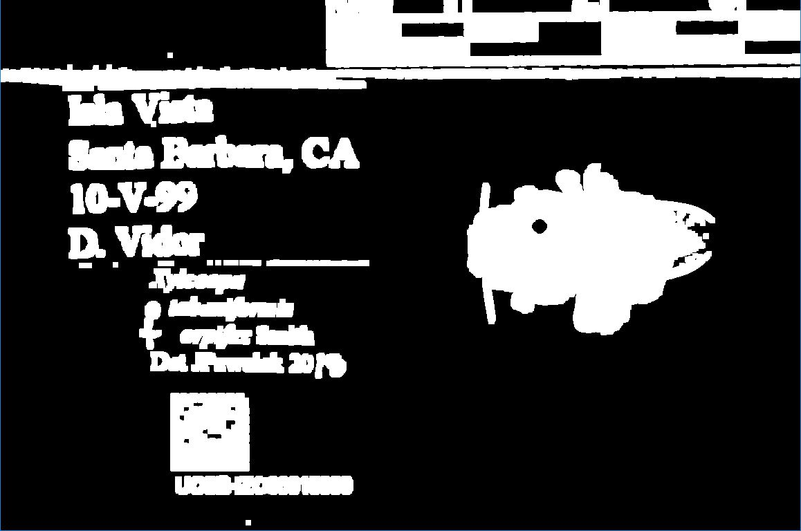
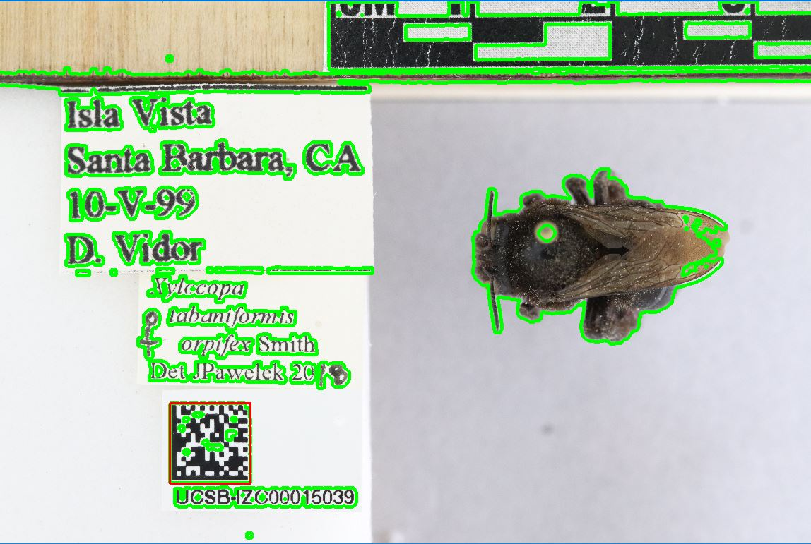

# Update 1

## Project Overview
For the first four weeks, we will be split into 2 groups to work on (a) Reading barcodes from bee images in a folder and renaming the images with the decoded barcode and (b) Extract exif data from each image and transferring the data into a tab delimited or comma delimited file (csv)
We will be using a sample size of bee images provided by Dr.Seltman. Each image contains a scale bar, information on locality date, a specimen, and a barcode(unique identifier for the specimen)

|  |
|:--:|
| <b>Image of a sample bee</b>|

Our weekly meeting consist of updating everyone on the respective group progress, receiving feedback for improvement, and what to-do for next time. 
Our goal is to have two scripts shared via Github for the Big-Bee project to use, draw feedback, and improve scripts if necessary.

## QR/Datamatrix Scanner 
Starting with a folder of images, we needed a method to read the images and decode them. For reading the images, we will be using [OpenCV](https://docs.opencv.org/4.x/d9/df8/tutorial_root.html), a library of programming functions primarily used for computer vision.

As for decoding the QR/Datamatrix codes embedded in the images, there are many available packages for reading QR/Datamatrix codes. 

Two main packages to read the codes from the images:

[QR Code Reader](https://pypi.org/project/pyzbar/) 

[Data Matrix Reader](https://pypi.org/project/pylibdmtx/)

Two problems when using these packages:
1.     Not every image is able to be read  
2.     In the case where the code is able to be read, the runtime is quite long 

Using the code readers alone, only 17/29 images could be read. Upon further research, we learned that some preprocessing is necessary to ensure the QR codes can be read consistently and faster. 

### Preprocessing 
Preprocessing is useful for reducing noise, shape recognition, and pointing the code readers directly to the QR/Datamatrix. 
One example of preprocessing is binarization, which is converting a grayscale image into a black and white image. The [Kraken] (https://github.com/mittagessen/kraken) package includes a binarization function. While the Kraken function did improve the accuracy and speed at which the QR/Datamatrix codes were decoded, it still took a little over 30 minutes to decode the 20/29 images provided. 

To improve the processing time, we experimented with different functions in the OpenCV library( i.e, threshold, findContours, cvtColor, resize, arcLength, etc.).
Since QR/Datamatrix codes are a black box shape, we can invert the color(i.e, black to white and white to black), and try to find the white regions. 
For the technique, we used simple thresholding. Under simple thresholding, every pixel is compared to a thresholding value and coverted to a color of black or white 
depending on the value(i.e, if the thresholding value is 200, any pixel value less than 200 is set to 0(black), otherwise it is set to maximum value (generally 255) for white. 

|  |
|:--:|
| <b>Image using Simple Thresholding</b>|

Next, we capture these white regions into a rectangular coordinate:
|  |
|:--:|
| <b>QR code isolated into rectangular box</b>|

Previously, the runtime was too long (~30 min for 29 images) because the decoding function had to iterate through the entire image to find the QR, then decode it. 
Now, the runtime was a lot faster (<2min); however, manual adjustment for the thresholding parameter is required. Since every image may have different lighting conditions in different areas, applying one global, thresholding value may not yield the desired result. With thresholding value adjustments, we can read 20/29 images to be decoded. 

For our next trial, we will apply adaptive thresholding. We chose adaptive thresholding because unlike simple thresholding, adaptive works well with images with different lighting conditions. Adaptive thresholding computes a different thresholding value for each pixel in a region of the image. After tweaking a few parameters, we were able to read more images (22/29) at a slightly faster time( <1.5 min).

Additionally, a script has been shared on github for user-friendly access. The script will detect barcodes and copy the renamed images into a new folder, while copying unreadable images to another folder and  preserving the original name.

## Exif Data Extractor
We began by researching different python modules that would be able to extract specific EXIF data from a folder of images. The [Pillow ExifTag](https://pillow.readthedocs.io/en/stable/reference/ExifTags.html) module proved to be the most efficient as well as the CSV python module.

Using this module we were able to construct a rough python script that iterated through a folder of images and produced a .csv file that contained specific EXIF data. 

We ran into a couple of problems:
1.     The ExifTags was unable to extract data from some images and caused the program to halt
2.     The produced csv file contained some data that was not human readable.
3.     It did not include the corresponding filenames for each image
Despite these issues, the runtime for this code was much faster than other modules that were tested. 

First, we focused on ensuring that the EXIF data in the .csv file was human readable. Upon further inspection of the documentation, we found that we needed to change some encoding manually. Certain fields with integer-encoded values were transformed by creating an internal dictionary that maps integer keys to their respective ‘readable’ values (i.e. Orientation, ResolutionUnit). Other fields with numeric values were adjusted to the appropriate scale or appended with a specific unit of measurement (i.e. ExposureBiasValue, FNumber). Duplicate tags were omitted and others included as needed.

We then tried to ensure that all extractable EXIF data was entered into the csv file. It seemed that the optimal solution to this issue was to do it in the renaming files process. However, we were informed that it was important to stay consistent with how the files were named as it was important to specific institutions to keep “.JPG” or “.jpg”. Therefore, a lot of progress on these changes had to be reevaluated and a different approach was necessary. 
 
Upon more discussion, we found that as we go through certain changes with the images (for example, running the QR code scanner and renaming the files) there may be some significant changes in the EXIF data. Therefore, in the upcoming weeks, we planned to track these possible changes to ensure that no significant information like date taken, resolution, brightness, etc. was altered or even lost.

### Next Steps

While we got the QR/Datamatrix scanner working for our small sample size, it is not guaranteed to work perfectly, as images vary in lighting and background noise. We hope to receive feedback from users of this project, as well as more samples for testing/updating our code. In order to obtain higher accuracy, we will have to add more ways of handling noise in the images.
	
With the Exif Data Extractor, we want to ensure that all EXIF data from a folder of images are extracted with their filenames unchanged. In addition, we would like to continue to track any significant changes in EXIF data when changes are made to images and filenames.

