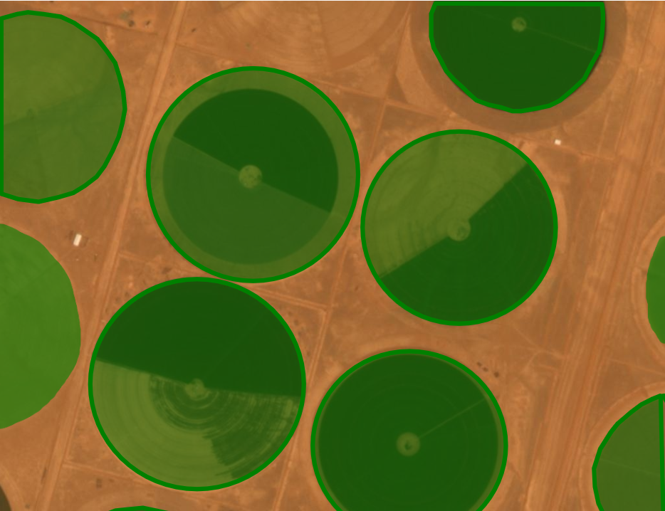
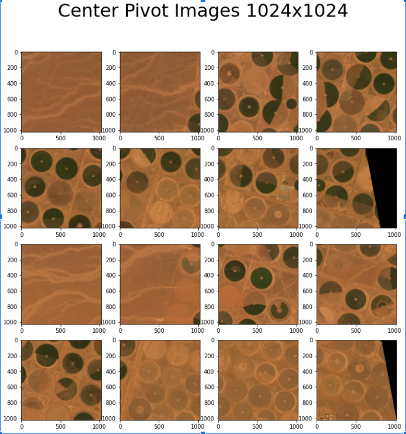

## Update 2

**Project: Combining computer vision and satellite imagery to map agricultural investment and water use.**

### Refresher
- As a refresher, our project aims to map agricultural expansion and irrigated water use by setting up necessary infrastructure, labeling images, and using that data to train computer vision models. 
- Focusing on **center pivot irrigation**, we hope to develop a model that will be able to classify active/inactive irrigation areas from satellite images.
```{note}
**Center-pivot irrigation**
This is an effective method of crop irrigation in which crops are watered by a circular pattern around a central pivot point. 
```
- Looking at the size of the center pivots can inform us about water availability
  - For instance, higher pressure systems can be larger. Thus, the volume of water depends on the pressure that pumps through them (could be 3km for high pressure) 

### Summary of Efforts
- Set up planet lab accounts - subscription that allows access to high-resolution imagery 
- Set up label studio - the image annotating interface we will be using to label active and inactive central pivots
- Working on retrieving and splitting images to generate our dataset
- Began to conduct literature reviews to explore other areas where there has been an expansion in this technology

### Results of Efforts
- The images that are pulled from the Planet API come in TIFF format (Tag Image File Format). Thus, we had to convert them into JPEG format before processing the rest of the image.
- Resolutions of these satellite images are 3 meters per pixel. This range of resolutions would usually not be able to fit a single center pivot. Center pivots are commonly 400-500m, but could be very large at greater than 1km. 
- We have to find a resolution that is able to capture a full center pivot. Larger images do come with a trade-off of smaller batch sizes during training neural networks due to not being able to fit too many large images into memory. Thus, since our goals do not require such precision, we will reduce the size of these images to 256 pixels x 256 pixels since it is able to capture a full center pivot.
- We will have to deal with labeling partial center pivots since an image may contain cut-off center pivots. For now we are choosing to label these partial center pivots the same as the full center pivots.



**Figure 1. An example of a labeled image that would be included in our dataset. These central pivots are located in Saudi Arabia.**



**Figure 2. Example of an image extracted from Planet Lab that is split into 1024 pixel by 1024 pixel image sizes. We will be using 256 pixels x 256 pixels instead for faster processing purposes.**

### Next Steps
- We plan to continue pulling images out of PlanetLabs and labeling them in LabelStudio to create a dataset of a few thousand images. 
- After creating our dataset, we plan to review neural networks and choose one to base our model on. We are currently leaning towards a convolutional neural network since the model allows for image classification.
- We are also planning a literature review around articles that include center pivots and irrigation expansion to further advance our knowledge of the usefulness of our model.
