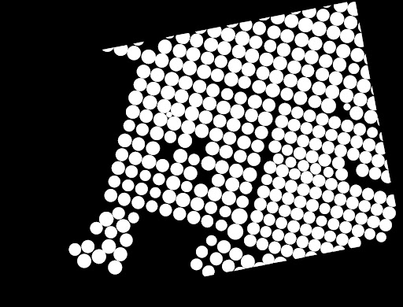

## Update 3

Mid-Spring Quarter Update

--- 
#### Project: Combining computer vision and satellite imagery to map agricultural investment and water use.
--- 

### Recent Efforts
This past quarter, ERI has been focusing on creating our training dataset and developing a pipeline for data augmentation and chipping our images. We shifted towards a transfer learning approach and eventually got in contact with the authors in which they provided their models for us to reference. 

#### Data Augmentation, splitting, and analysis 
We split the larger region of center pivots into smaller image sizes (512x512) by using a sliding window over the image. The window specifies chips (512x512 regions in the image and the label) to be saved individually. The window moves by 256 instead of 512, because we want to increase the chances that we have a full center pivot label in a chip. Chips with no center pivot would be discarded. Each of these chips are then rotated (90, 180, 270). Then each of those are flipped (horizontally, vertically) to increase our data by twelve times. 

### Successes and Challenges
#### Transfer learning
- We found a paper that is very similar to what we wanted to achieve so we adopted a transfer learning mechanism for our project. The paper we are referring to is “Automatic Mapping of Center Pivot Irrigation Systems from Satellite Images Using Deep Learning” (https://www.mdpi.com/2072-4292/12/3/558/htm) and was published on February 7, 2020 by Marciano Saraiva, Églen Protas, Moisés Salgado, and Carlos Souza. The main goal of the paper was to use computer vision to identify center pivots in a certain part of Brazil, which is very similar to our project goal of using computer vision to identify center pivots in general. Because their model is uniquely trained to a certain study area in Brazil, we want to take their model and tweak it so that it can hopefully identify center pivots around the world. We were lucky enough to find their trained model on their GitHub repository and have been messaging Marciano Saraiva on LinkedIn regarding any clarifying questions we have. Unfortunately, some of the challenges we have faced with the transfer learning method have been to try and understand the code since there isn’t a lot of commentary about what the code means. They also have two different trained models, one that uses Google Earth Engine satellite imagery and one that uses Planet satellite imagery, so it’s been difficult to figure out what exactly to change and what formats they are using. 

#### Data labeling
- Originally, our plan for creating the labeled dataset involved splitting the raw image first and then labeling each of the split image tiles. This would have taken a lot of time and effort, as we would have had to label thousands of images individually. Fortunately, we discovered a way to split both the raw image and the labels together. ***This allowed us to only label entire raw images rather than thousands of chipped image tiles.***

#### JSON_MIN to TIF Mask (from LabelStudio)
- In order to split the raw images and the labels together, we first needed to export the labels from our annotation tool, Label Studio. We then needed to transform the labels from JSON to TIFF formats in order to perform the image chipping. To do so, we created a function that transforms the JSON labels into a binary mask, and then saves it as a TIFF. The function first creates an array of zeros with the same dimensions as the raw image. Then, it uses the skimage.draw package to change the coordinates of the labels in the zero array to ones.

### Looking forward:
- In the next month, we plan to finally train the U-NET model on the dataset that we created from the images that we have labeled and augmented. This will allow us to evaluate how well our model performed and what else we need to do to tweak it. We also want to consider how well the model will perform with images of the same pivots at different points in time. We also want to make sure that our dataset and data pipeline is open-source so we plan to upload our data and model on [Radiant Earth](https://www.radiant.earth/), which is a cloud-based open library dedicated to Earth observation training data for use with machine learning algorithms.
- Our end goal is to create a trained model for more generalized detection of center pivots. To do this, we want to train the pre-built UNET model on the datasets that we created through our data pipeline. If we have time, we may try to build our own U-NET model from the ground up, or try to implement another computer vision model (Mask RCNN, etc).
