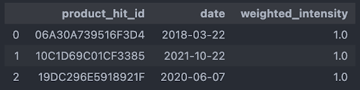
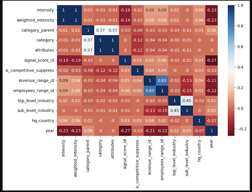

# hg_insights
Project description

### Overview
HG Insights is a data analytics company that offers an intelligence platform to help optimize strategic planning and sales execution. Our capstone team is working with HG Insights to develop a machine learning model to predict the adoption of existing and/or new technologies based on the respective qualities of a company. The primary goal of this project is to analyze patterns in product adoption to effectively engage with existing and/or potential customers.
Our primary dataset consists of two large datasets regarding many company’s qualities across the United States over a span of 20 years ranging from 2020 to the present. The results of this project could potentially lead to cost and time effective solutions for companies.  

### Goal of the Project
Our primary goal for this project is to predict future technology purchase based on products adopted at a company. Using the company’s firmographic information (name, url, geo, revenue, employee count, industry), product information (vendor information, release date, related products category/taxonomy) and product adoption information (first date product detected, most recent date product detected, product intensity). Such that companies get to ask questions like ‘Show me Automotive Companies in Germany who HG Insights predicts is going to purchase SAP HANA’.  

### Data
Two main datasets were provided to us, “capstone_install_data_20220111.csv” and “capstone_time_data_20220111.csv.” Both datasets contain information collected by HG Insights on the products and technologies in use at the companies recorded. The first dataset contains information by company and by product of the first and most recent confirmed date that a specific product/technology is observed, as well as information about the company (including revenue, employee count, industry of the company, country of location, etc) and information about the product (including categorization of the product, whether or not it belongs in a competitive group, recency of signal presence, and a unique intensity and weighted intensity value which indicates the signal strength which is a measure of the confidence that the product is/was in use at the time recorded).

The second dataset is a time series record of every confirmed installation of a product at the company it is recorded at. This dataset only contains three columns, an ID value of the product unique to HG’s proprietary data feed, the date of verification, and the weighted intensity value (which is the same metric as in the install dataset.

_Install Data (sample n = 3)_

_Time Series Data (n = 3)_

### Progress
So far, we worked on cleaning the data and did some exploratory data analysis. We dropped a couple columns that have too many NAs in them,  and tried to use different methods to find the correlations between the variables and the products such as heatmap, random forest, and permutation feature importance. 

### Obstacles
_Heatmap_: We couldn’t find much relationship in the figure, even though we tried 3 different calculation methods (pearson, spearman and kendall)
_Random forest_: The data is so big that we were having a hard time finding the estimated number of runs, because it would take a lot of memory to run a cross validation to find the right number.
_Permutation Feature Importance_: In the random forest page, I found a warning right below.
_property feature_importances_, it was saying that random forest tends to pick the variable which has more categories, so I tried the alternative method the website recommended, which is permutation feature importance, and I got the result as the figure shown below. One problem I had with this method was again the data is so big that my computer is not able to work through more data as it is supposed to, I only picked 1% of the data as sample, and used all my CPUs, and it barely made it through. 
Another concern I have is that we should make an agreement with what is our input and output, so that we can start our next step.

Pearson Figure:

### Questions and Objectives:
For our project we are dealing with a massive amount of data. The short term goal is to find features and variables that are informative and associate with products.The long term goal is to use the features that are highly correlated or that we will feel is significant to build a model that will predict/forecast future product purchases.   

