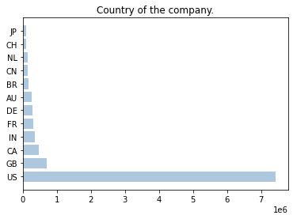
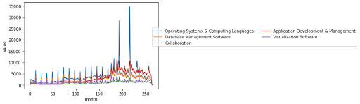

# Update 2

##                                             HG INSIGHTS

Team Members: Atherv Gole, Cristian Razo, Eric Cha, Natasha Leodjaja, Qimin Tao <br>
Sponsor: Rob Fox <br>
Mentor: Leron Reznikov <br>

### Overview
Given HG Insights’ proprietary signal data on current technology usage across the companies that they track, our goal is to see if we can create models with predictive power that can use previous and current adoption/usage data to recommend future technologies and products that companies might purchase. The data that we are using to do this includes two main sets; one time series dataset that includes every occurrence of a technology that is observed by HG Insights, and the second consolidates this data by company and product, with the time series portion being condensed into first and the latest occurrences of the product signal.


### Progress
After the exploratory efforts that we covered in our last update, the past few weeks, our focus has been on creating and finalizing reproducible processes for data cleaning and organization. 

One of the obstacles we’ve dealt with has been the handling of categorical variables. In the dataset provided to us, 6 of the variables that we considered informative were categorical, one of them being a delimited list of unique attributes. The best solution we felt was to one-hot encode the categorical variables and retain as much information as possible. However, in encoding multiple columns, the resulting dataset contained 100-200 columns depending on which columns we retained/encoded. 

To handle this overhead of columns, we tested a few dimension and cardinality reduction methods. One prominent one, detailed in [this Towards Data Science post](https://towardsdatascience.com/dealing-with-features-that-have-high-cardinality-1c9212d7ff1b#:~:text=A%20categorical%20feature%20is%20said,absence), involves reducing cardinality with *cumulative categorization.* This method allows a threshold to be set, and will retain unique values in a categorical column with the highest frequencies totalling in that threshold. Any values beyond that point will be categorized in an *Other* category. For example, if a column ‘Color’ held values with frequency as follows: Green: 5, Red: 3, Yellow: 1, Purple: 2. With cumulative categorization with a threshold of 0.8 or 80%, The column would be transformed into the following values with frequencies: Green: 5, Red: 3, Other: 3. This reduces cardinality by 25%, and once one-hot encoded, this would reduce the resulting dataset by 1 column. 


We focused on visualizing and performing statistics on the data to further understand it, and by transforming the time data, we can clearly see the flow of product changes through history.

On the corporate side, we found that the vast majority of the data comes from US companies. Also, the correlation coefficient between company revenue and number of employees is 0.844 instead of 1. This indicates that some companies generate higher revenue with fewer employees, but some companies generate lower revenue with more employees. We also found that about 20% of the companies used almost 80% of the products, which is very much in line with the Pareto principle. Finally, we wanted to observe whether there was overlap in the same category of products in each company, and choosing verizon to observe, we found that there was overlap in the same category of products, but also that there were iterative updates to their products. Of course, because this is a large company, the number of products used is very large, and it is normal to see overlap.




Figure 1. The number of companies in different countries.


Second, consider it in terms of time. We first divided the time interval into one month so that we could describe the data in more detail. We found that the first, second and third ranked products for each month have changed in the last 20 years. In the beginning decade, Database Management Software and Operating Systems & Computing Languages were the first and second products, and in the latter decade, Application Development & Management gradually increased, and even surpassed Database Management Software and Operating Systems & Computing Languages in the last few years.





Figure 2. The number of common product categories over time.


Third, we plotted heatmaps on important variables that have some correlation coefficients with time for these features, but almost none between features.


### Next Steps
Our next steps after formalizing our data sanitization process are to move into predictive modeling to test out the relationships between the data and our outcomes. Our goal is to create a recommendation system that will allow us to feed company information into the model, and return products that the specific company might adopt next. In order to do this, we are looking into different types of recommendation systems, as well as handling of categorical variables. We’re looking to model our system after similar recommendation processes with scoring such as the popular Netflix recommendation model.


```python

```
