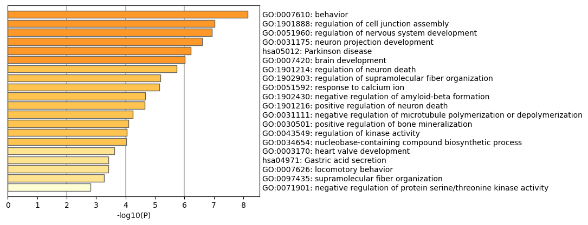
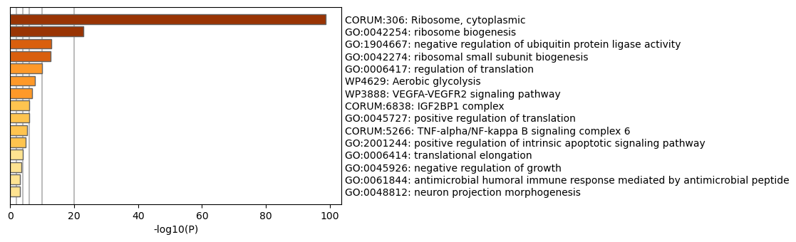
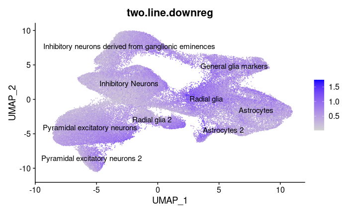

## NRI Group Update 3

## Current Efforts 
In the past month we have spent a lot of our time performing different statistical methods on our data. Primarily we started off by using sctransform to normalize our data in order to recover sharper biological distinction compared to log-normalization. After doing so we performed dimensionality reduction by PCA and UMAP embedding as mentioned in update 2. 
During week 2 and week 3, we revised our manual cell type identification last quarter and explored beyond our original plan of manual annotation. We utilized tools like [SingleR](https://bioconductor.org/packages/release/bioc/html/SingleR.html) and [ScType](http://session.asuscomm.com/) to automatically annotate cell types. Though these results confirmed the correctness of our results, we still chose to utilize the manual result because the automatic cell types are too broad to have further inference. We sent our manual annotation results to the kosik lab and obtained the verified final result. 

Then, we continued by performing differential expression tests on our data. We tested differential expression between the mutant and the control(wildtype) cell groups, specifically the 337VM, 406RW, and 406WW mutations. We first performed DE on All Wildtype Cells vs. All Mutant Cells ("406RW", "337VM", "406WW") by the default Wilcox Rank Sum Test and MAST method. The Wilcox method is a non-parametric test that compares the ranks of expression values between two groups. The [MAST](https://genomebiology.biomedcentral.com/articles/10.1186/s13059-015-0844-5) method is specifically developed for single cell RNA-seq DE analysis and it takes not only into account the expression value, but also the detection rate. In addition, considering the test performance and robustness indicated by paper [Bias, robustness and scalability in single-cell differential expression analysis](https://www.nature.com/articles/nmeth.4612), we decided to use MAST for both all-line comparisons and later single line DE comparisons.

The 337VM mutation is a 3 line mutation, 406RW is a 2 line mutation and 406WW is a 1 line mutation. The number of lines refers to how many different donors were sampled with the particular mutation. Because the 1-line mutation did not have a corresponding control line, we ignored it for individual line analysis. 

## Findings

Finding ontology differences between control and mutant cell lines through enrichment analysis on differentially expressed genes yielded some interesting results. 
We found that looking at an individual mutation and its control yielded the most interesting ontologies, particularly for the 406 mutation. Perhaps this is because differences between cell lines (taken from different donors) could overpower differences between our variable of interest, control vs. mutant. 

|  | 
|:--:| 
| *Ontologies upregulated in 406 mutation vs control* |

Generally, ontology analyses yielded a mix of interesting and seemingly irrelevant results. Key ontologies upregulated in in the mutant line were **neuron projection development**, **Parkinson disease**, **regulation of nervous system development**, **positive regulation of neuron death**, and **negative regulation of microtubule polymerization or depolymerization**. The The tauopathies we are studying are closely tied to Alzhiemer's and other neurodegenerative diseases, but is not closely linked to Parkinson's, so that ontology is an interesting result. Overall, it is encouraging that many ontologies associated with neurodegeneration (neuron death, etc) are present. Upregulation of negative regulation of microtubule polymerization or depolymerization also reflects the current literature; the leading proposed mechanism of taupathy is neurofibrillary tangles caused by malformed tau proteins, which disrupt microtubule formation (polymerization) and can cause them to dissociate (depolymerization). Microtubules are key to cell structure as well as intracellular transport, and affect many key functions in neurons. This can explain the wide range of observed effects of the mutation. 

|  | 
|:--:| 
| *Ontologies downregulated in 406 mutation vs control* |

Downreguled ontologies had equally interesting results. Ribosomes, which are organelles that produce proteins (translation) appear to be downregulated. **Positive regulation of translation** is also downregulated. This all points to a picture of the mutation, perhaps indirectly, reducing the formation of new proteins in brain cells, which could trigger wide-ranging consequences. This finding was first proposed in a [paper](https://www.ncbi.nlm.nih.gov/pmc/articles/PMC4719006/) in 2016.

We also wanted to use our clustering results to see how the mutation affects gene expression associated with different types of cells. 
|  | 
|:--:| 
| *Average cell expression of genes downregulated in mutant line* |

Downregulation seems to most occur in Astrocytes and Radial Glia, and less so in neurons. These are key structural cells in the brain, so it's possible that microtubule disruption impacts them in particular. 

## Future Work
We have broken up our future on a week by week basis in order to keep ourselves accountable and have concrete deadlines for ourselves. 
- Week 5: 
  - We will finish working with Differential Expression Analysis
  - We will introduce Monocle3 to identify differences in spatiotemporal (time of cell and location of cells) relationships between genes in mutant and control cells
    - [Monocle3](https://cole-trapnell-lab.github.io/monocle3/) can help you perform three main types of analysis:
      - Clustering, classifying, and counting cells. Single-cell RNA-Seq experiments allow you to discover new (and possibly rare) subtypes of cells. Monocle 3 helps you identify them.
      - Constructing single-cell trajectories. In development, disease, and throughout life, cells transition from one state to another. Monocle 3 helps you discover these transitions.
      - Differential expression analysis. Characterizing new cell types and states begins with comparisons to other, better understood cells. Monocle 3 includes a sophisticated, but easy-to-use system for differential expression.
- Week 6: 
  - We will wrap up Monocole3 trajectory analysis
  - We will introduce WGCNA
    - [Weighted correlation network analysis (WGCNA)](https://horvath.genetics.ucla.edu/html/CoexpressionNetwork/Rpackages/WGCNA/) can be used for finding clusters (modules) of highly correlated genes, for summarizing such clusters using the module eigengene or an intramodular hub gene, for relating modules to one another and to external sample traits (using eigengene network methodology), and for calculating module membership measures. 
- Week 7: 
  - We will continue working with WGCNA
- Week 8:
  - We will wrap up with WGCNA and revise our final presentation
- Week 9/10:
  - Wrap up everything
    - look at all the results we have from DE, Metascape, Monocle3, WGCNA
  - Start finalizing presentation and poster 
  - Practice for presentation
