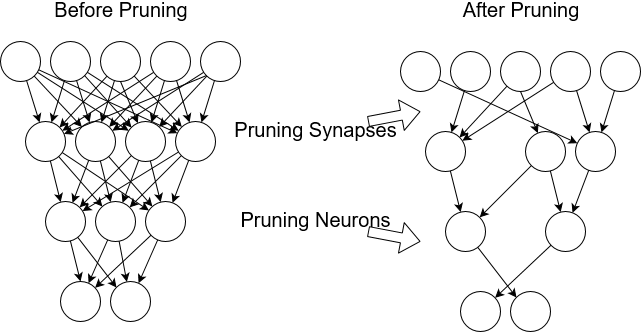
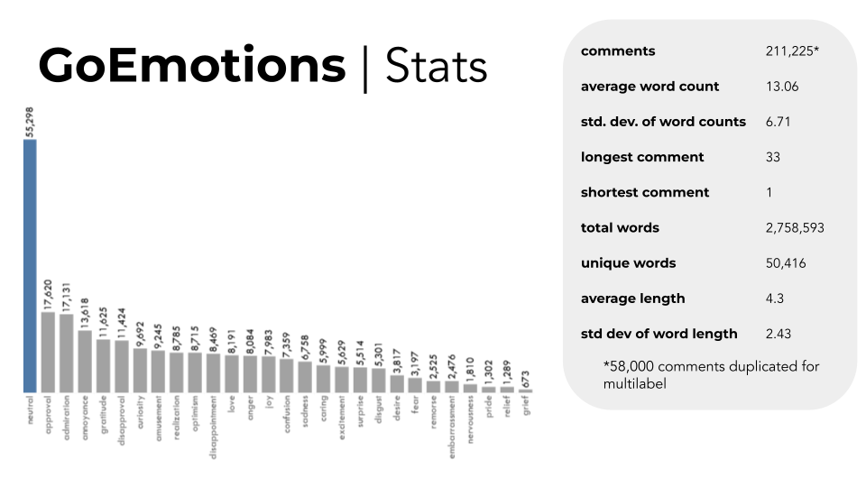
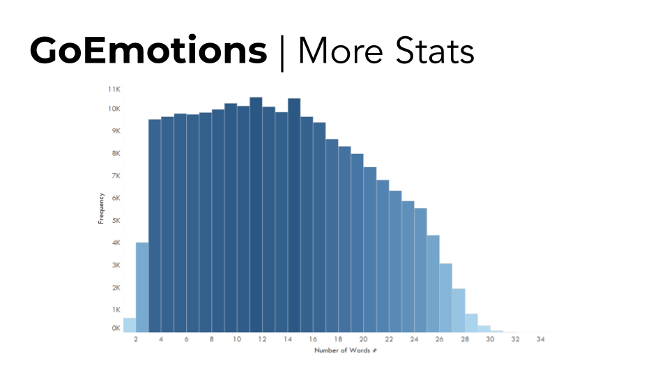

# Update 1: Preliminaries

## Preperation
**What is model compression?**

- A series of methods to reduce model size, thus to reduce training time, reference time, and memory usage.

The first three weeks were primarily used to research and get familiar with methods used for compressing ML models. An example of a particular method is 'pruning', which in short is the process of removing redundant weights or neurons without impacting model accuracy. 

We will discuss and provide analysis in more detail on the methods we will be using once our initial model is built. 

## Initial Model Consideration

### The Plan
Our sponsor Rob Bernard and his colleagues from PwC were interested in working with a language-based dataset and gave us the lead on finding a reasonably clean dataset and the task the model would learn. The focus of the project is primarily on compression methods so it was in our best interest to be modest with the task. Our group decided that emotion classification[^1] would be achievable without becoming a time constraint. 

### The Dataset 

The GoEmotions[^2] dataset compiled by researchers from Stanford, Google, and Amazon is the largest manually human labeled dataset. It consists of 58,000 Reddit comments from English subreddits and 27 emotions plus neutral as labels. The dataset was compiled in a careful manner with some notable preprocessing being: manual review, length filtering, sentiment balancing, emotion balancing, and masking. Moreover, The number of examples with 2+ raters agreeing on at least 1 label was 94% which provided us with more confidence in choosing this dataset.

### Preprocessing 
We did some additional preprocessing by changing the 27 emotion labels into 6 based on Ekman's basic emotion set which came from the emotion taxonomy in the GoEmotions paper. This was implemented for efficiency purposes when training the model. For our initial goals the loss of information is tolerated as long as we achieve a reasonably robust model. 

## Objectives

Our goal by the end of next week is to have a model built and find a metric to gauge its performance. If everything goes according to plan we will have a benchmark model for comparison with models that we will be applying compression methods on.

[^1]: https://en.wikipedia.org/wiki/Emotion_classification

[^2]: https://arxiv.org/pdf/2005.00547.pdf

