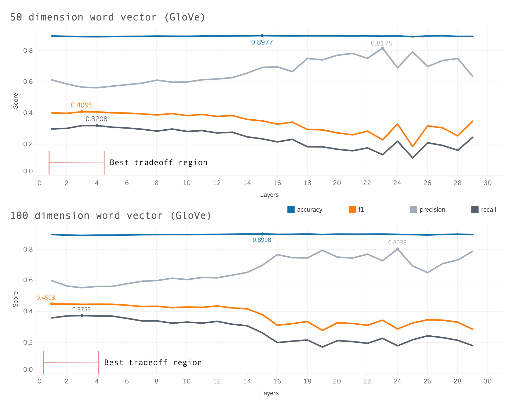

#  Update 2: First Dive into Compression

## Benchmark
As briefly covered in the first update, A simple model is more desirable for the initial trials with model compression methods. After some testing with different word embedding models we were able to achieve desirable results. The model is currently using Stanford's GloVe (Global Vectors for Word Representation)[^1] for the word embeddings. For the emotion classification we are using a standard Sequential Model[^2] which is constructed with Adam, Relu/Sigmoid activation, and a dropout layer.

### Key Metrics
Because of the imbalance in classes, we choose the $\mathrm{F} 1$  score as our statistic among other metrics to measure the performance which is the usual convention for this type of task. 

$$\text{$F1$ Score} =2 \cdot \frac{\text { Precision } \cdot \text { Recall }}{\text { Precision }+\text { Recall }}$$

where

$$\begin{aligned} \text { Precision } &=\frac{T P}{T P+F P} \\[2.5mm] \text { Recall } &=\frac{T P}{T P+F N} \end{aligned}$$

Precision measures the percentage of true positives from all positive cases detected by the model, while Recall(sensitivity) measures the percentage of positive cases the model detects successfully. Notice that $\mathrm{F} 1$ score reflects both metrics: the $\mathrm{F} 1$ score is high only when both Precision and Recall are high.

### Some Tuning
We initially had some RAM issues running GloVe for vector representation of words of higher than dimension of 100. Thus testing was done with 50 and 100 and we achieved modest $\mathrm{F} 1$ scores in the high 40's range. Comparing to the GoEmotion[^3] paper that achieved a score of 62 for the Ekman style grouping left much to be sought after. Note that our model at this stage was 936KB relative to a standard BERT model which is substantially larger and more robust. 

---
**Note**: We are still fine-tuning the model as we move onto other tasks.

---

Layer selection was chosen manually by running 30 epochs with 5 trials with an average taken across the trials.

The figure depicts the "best tradeoff" region and shows additional layers do not provide a more optimal model when we want to maximize $\mathrm{F} 1$. 

## Compression
Moving into the main objective of the project. Our first method is a form of model compression called Quantization. 

### Quantization 
Quantization from a mathematical standpoint is the process of taking a set of larger floating point numbers and mapping them to a set of smaller ones. A simple example is converting FP32 (floating point 32 bits) to a smaller precision like INT8 (Integer 8 bit) which is commonly known as 8-bit quantization. 

There are two forms of quantization: post-training quantization and quantization aware training. The tradeoff being post-training is easier to implement while the latter in practice provides better model accuracy.

**Note**: We are currently looking at implementing both forms.

#### Symmetric and Asymmetric
The two most common forms of *calibration* are Symmetric and Asymmetric.

1.  **Asymmetric** quantization, we map the min/max in the float range to the min/max of the integer range. This is done by using a **zero-point** in addition to the scale factor.
2. **Symmetric** quantization, instead of mapping the exact min/max of the float range to the quantized range, we choose the maximum absolute value between min/max. In addition, we don't use a zero-point. So, the floating-point range we're effectively quantizing is symmetric with respect to zero, and so is the quantized range.
---
Symmetric quantization is incredibly quick to calculate, because we do not need to compute the zero point of reference, and we only consider the absolute maximum value. Asymmetric quantization is particularly useful for quantization when the distribution of weights/ activation outputs are are heavily asymmetric, but it comes with a higher cost. From our readings, **an efficient method is to use symmetric quantization for weights, asymmetric quantization for activation outputs with a subset of models weights.**

**Example**: A general quantization function:

$$Q(w)=\operatorname{Int}\left(\left(\frac{w}{\beta-\alpha}\right) \cdot(2^{n}-1)\right)+z$$

where $\alpha,\beta$. are clipping ranges to be chosen, $\mathrm{z}$ is a zero-point. Choosing
$\alpha, \beta$ is what we referred to earlier as *calibration*. 

---

#### Percentiles

The idea with percentiles Is to set the range to a percentile of the distribution of weights seen during calibration. In practice, many pre-built functions that perform quantization only take a look at the maximum and the minimum weights. We hypothesize that with the imbalance in classes there will be outliers in the distribution of weights across the layers.  Thus, the manual function will provide the better tradeoff between robustness and compression.  

--
**Example**:
For symmetric quantizations: for 99th percentiles, we can can take
$\beta=|w|_{0.99}, \alpha=-\beta$. For asymmetric quantizations: we can can take
$\beta=w_{0.995}, \alpha=w_{0.05}$
and implement the same quantization functions. If a weight exceeds a particular upper bound, we replace that weight with the upper bound/ lower bound percentile and transform it accordingly.

---

## Week 10 goal

1. Create a Quantization function that considers the distribution of weights across layers and implements quantization accordingly.
2. Analyze the tradeoff between performance and compression of the custom method.  

## Looking Ahead
1. At this moment in time we were able to resolve the RAM issue and get the 300 dimension word vectors GloVe model functioning. We are working on optimizing the trial model before running some final tests. We hypothesize that this model will produce the best results. 
2. We hope to create our own word embeddings which would give us more access to applying compression methods elsewhere besides the layers of the model. 
3. After our trials it is likely we might proceed with a more challenging task and a more robust framework to limit test our compression methods. A possible consideration would be working with audio/visual data. 

[^1]: https://nlp.stanford.edu/projects/glove/ 
 [^2]: https://keras.io/guides/sequential_model/
 [^3]: https://arxiv.org/pdf/2005.00547.pdf

 
