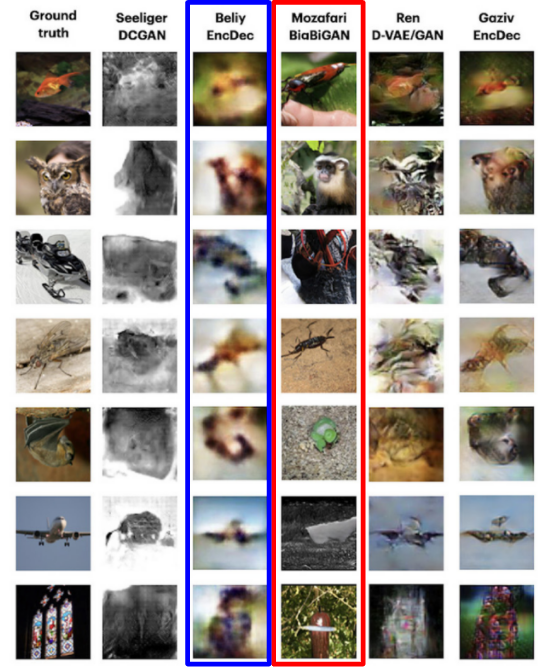

# Update 1
Currently, we are studying the effects different visual stimuli produce in activity in different regions of the brain. Doing so will allow us to understand which regions are responsible for which recognition tasks, and ultimately how specific activation patterns are produced from specific types of images seen.

******

## Background on Computational Neuroscience
Listed below are a few concepts and definitions that we will be referencing throughout our project.

- *Blood Oxygenation Level Dependent Signal (BOLD)*
  - neural activity consumes oxygen → need for oxygen in brain region → rush of blood flow to brain region
  - slow: takes ~4.6 seconds for BOLD signal to arrive after neural activity

- *Functional Magnetic Resonance Imaging (fMRI)*
  - using magnetic resonance imaging to measure brain activity associated with blood flow
  - measures BOLD signal → signal becomes brighter 

- *Voxels*
  - 3D volume of brain tissue
  - each voxel represents ~1 million brain cells
  - clusters of voxels in one region of the brain appear and “light up” on fMRI scan when BOLD signal is detected

- *Generative Adversarial Networks (GANs)*
  - generative model that contains generator and discriminator networks
  - adversarial training → put generator and discriminator in opposition, improving both iteration after iteration
  - generator G takes a random noise vector z and generates fake sample G(z) with the same statistics as the training set image
- *Variational Autoencoder (VAE)*
  - generative model that consists of an encoder-decoder framework
  - input data encoded to vector that represents data’s latent attributes
  - decoder network takes encoded vector and attempts to recreate original input
  - variational autoencoder uses probability distribution for latent attributes

******

## Natural Scenes Dataset
For our project, we are using the Natural Scenes Dataset (NSD), which is a large-scale fMRI dataset consisting of whole-brain, high-resolution fMRI measurements of 8 healthy adult subjects while they each viewed 9,000-10,000 color natural scenes over the course of 30–40 scan sessions distributed over the course of a year. During these scan sessions, the subjects engaged in a continuous recognition task in which they would report whether or not they had seen their given image previously in the experiment. In some of these fMRI sessions, physiological and eye-tracking data were collected, whereupon further analysis indicated that the participants were generally able to maintain central fixation. 

In total, NSD includes responses to 70,566 distinct natural scene images, and also includes a variety of anatomical neuroimaging measures, functional neuroimaging measures, and behavioral measures. In addition, a large amount of auxiliary measures were included such as resting-state data, external physiological measures during the resting-state scan sessions, diffusion data and associated derivatives, and a collection of manually defined regions of interest (ROIs).

|  | 
|:--:| 
| *Figure 1. Example data from Natural Scenes Dataset.* [1]|

******

## Deep Image Reconstruction
Deep image reconstruction is the task of fully reconstructing a visual stimulus given just a patient’s fMRI data. Though many works have recently developed deep learning methods for this task [2], no methods to our knowledge have made use of a dataset as large as provided in [1].

| | 
|:--:| 
| *Figure 2. Comparison of datasets that have been used for Deep Image Reconstruction (DIR). Natural Scenes Dataset has not yet been used for this task.* [2]|

Deep image reconstruction methods can be placed into two categories:
- Generative Methods
- Non-generative Methods

Generative methods such as [3] or [4] make use of GANs and/or Variational Autoencoders to map from fMRI data to pixel-space. Non-generative methods such as [5] or [6] provide either iterative algorithms or encoder-decoder style networks which map the fMRI data to a latent space which is then decoded into pixel-space.

| | 
|:--:| 
| *Figure 3. Sample encoder-decoder network.* [6]|

One noticeable difference between the two approaches is the “naturalness vs fidelity” tradeoff [2]. The methods which use generative models pre-trained on natural images tend to produce images which are clearer but lack the correct objectness of the stimulus. Non-generative methods will often reproduce the correct high-level features of the stimulus, but will be very blurry.

|  | 
|:--:| 
| *Figure 4. Results highlighted in blue represents  non-generative method. Results highlighted in red represents generative method.* [2]|

******

## Future Tasks/Work:
One possible avenue of exploration includes the usage of a large Image Dataset such as COCO and attempt to map such images directly to a predicted fMRI response. Alternatively, the other direction may also be employed, where we attempt to reconstruct certain images based solely on the fMRI data. Both of these techniques have been employed before, however NSD offers a significantly larger data sample, which removes many limitations on the choice of models. Previous works were accomplished in a linear regime between features. With NSD, it is possible to apply more complex models and obtain stricter parameters to relate brain activity and images. 

There exist many pre-trained models due to the sheer complexity of image recognition and feature deconstruction and reconstruction. However, they are not absolutely necessary for training a model and serve as a potential basis to take a new approach when analyzing the relationship.

Over the next few weeks, we seek to familiarize ourselves in  methodologies to better handle the large dataset, and train generative models with or without a basis. Furthermore, we hope to finalize a decision on what specifically we wish to do with the dataset and implement proper networks to pursue the goal.

******

## References
[1]  **[Natural Scenes Dataset](http://naturalscenesdataset.org/)**

[2]  **[Natural Image Reconstruction From fMRI Using Deep Learning: A Survey](https://www.frontiersin.org/articles/10.3389/fnins.2021.795488/full)**

[3] **[End-to-end deep image reconstruction from human brain activity.](https://pubmed.ncbi.nlm.nih.gov/31031613/)**

[4] **[Reconstructing seen image from brain activity by visually-guided cognitive representation and adversarial learning.](https://pubmed.ncbi.nlm.nih.gov/33395572)**

[5] **[Deep image reconstruction from human brain activity.](https://pubmed.ncbi.nlm.nih.gov/33222145)**

[6] **[From voxels to pixels and back: self-supervision in natural-image reconstruction from fMRI](https://proceedings.neurips.cc/paper/2019/hash/7d2be41b1bde6ff8fe45150c37488ebb-Abstract.html)**