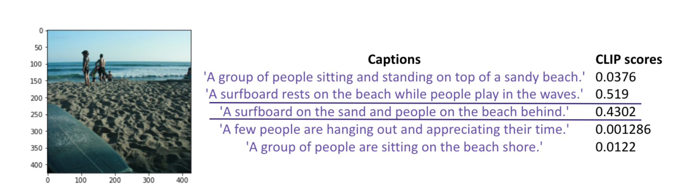

# Update 2
Our team is using the Natural Scenes Dataset, a large-scale fMRI dataset, to study the effects of different visual stimuli on brain activity. Doing so will allow us to understand which regions are responsible for which recognition tasks, and ultimately how specific activation patterns are produced from specific types of images seen.

Since our first update, we have gathered more information on various methodologies that will provide optimal image reconstruction. The concepts we are currently focusing on include Natural Language Processing and the usage of a generative adversarial network (GAN). 

******

## Natural Language Processing

Natural Language Processing refers to the ability of computers to be able to process words and sentences in the same way that human beings can. Finding a deep language model that can accurately complete, translate, and summarize text will be very beneficial to us as we would be able to improve the mapping precision of word embeddings to brain responses. Though, the difficult part is finding or building a model that can do so since its accuracy is primarily dependent on its ability to predict words from their context, whereas the brain performs many complex tasks that can be challenging to predict. In order to address this issue, a study was conducted, comparing a wide variety of deep language models to human brain responses to sentences recorded with fMRI and source-localized magneto-encephalography (MEG) [1]. 

|  | 
|:--:| 
| *Figure 1. Example of MEG score averages across different models and parameters* [1]]|

These results show that these deep language models tend to converge towards brain-like representations, and that the middle layers typically perform the best.

For our project, one of the ways that we are trying to incorporate Natural Language Processing is through the CLIP (Contrastive Language–Image Pre-training) model zero-shot classification. CLIP pre-trains an image encoder and text encoder to predict image and text pairings, which is then used to turn CLIP into a zero-shot classifier [2]. CLIP will then be able to take the image vector, encode it to the image text space, and estimate the text most likely to correspond to the image.

|  | 
|:--:| 
| *Figure 2.  Example of CLIP classification* [2]]|

******

## StyleGAN Architecture

Generative adversarial networks (GANs), introduced in only 2014 [1], have quickly become powerful tools in generating synthetic data such as natural images. One recent work which is able to produce very realistic images is the StyleGAN [2] architecture. StyleGAN builds off of ProGAN [3] - a type of GAN in which the model produces only low resolution images at the start of training and gradually increases the clarity of the image over time.

We are using StyleGAN in our project as it is highly flexible and one of the best models for producing realistic-looking images. The fMRI to image task is very similar to a well-studied task known as text to image. The state of the art in text to image is a model known as LAFITE [4]. Since training a text to image model is expensive as it needs many text/image pairs, LAFITE provides a method in which a text to image model can be trained using only images. Each image is passed through a CLIP image encoder and the output vector is perturbed with some noise. This vector (represented as h’) is an approximation of a latent representation of a corresponding caption for that image being passed through the CLIP text encoder. Then the model decodes from this vector to a natural image. At inference time, LAFITE can produce an image from a text query by passing the query through the CLIP text encoder and then through decoder. We can do something similar to LAFITE, but with our fMRI/image pairs.

|  | 
|:--:| 
| *Figure 3.  Loss Functions from LAFITE* [4]|

******

## Future Tasks/Work:

After looking at multiple different architectures from different sources, we decided that a good goal would be to emulate the CLIP encoder and decoders. One key difference will be that instead of mapping between text captions and images, we will be directly mapping from an fMRI vector directly to the image space provided by the COCO dataset. 
This is ambitious in the long term, so for the near future, we will be mainly focusing on translating a second generation NVIDIA neural network autoencoder template for text to image and the decoder for image to text to read fRMI vectors rather than text vectors. This will be significantly easier than building it from scratch, and perhaps will be easier to troubleshoot. The more difficult part will be recognizing which other part(s) of the template we are using for image to text encoder need to be altered. For example, the DataLoading class will need to have some slight modifications as our input vector will have different features than a text based input vector. 

Other possible areas of modification may include, but are not limited to the loss function, as that has been specifically optimized for the text encoder. We may choose to run a simpler or default loss function as proof of concept before tweaking it to better suit the needs of the fMRI vector. Overall there seems to be dozens of other files, some of which we have not gotten the chance to review in depth within the reference we are using. One main goal will be to finalize all changes necessary in our attempt at translating, despite some of the code and mathematical basis being quite advanced.

******

## References
[1]  **[Brains and algorithms partially converge in natural language processing](https://www.nature.com/articles/s42003-022-03036-1 )**

[2]  **[CLIP: Connecting Text and Images](https://openai.com/blog/clip/ )**

[3] **[Generative Adversarial Nets](https://arxiv.org/pdf/1406.2661)**

[4] **[A Style-Based Generator Architecture for Generative Adversarial Networks]( https://arxiv.org/abs/1812.04948 )**

