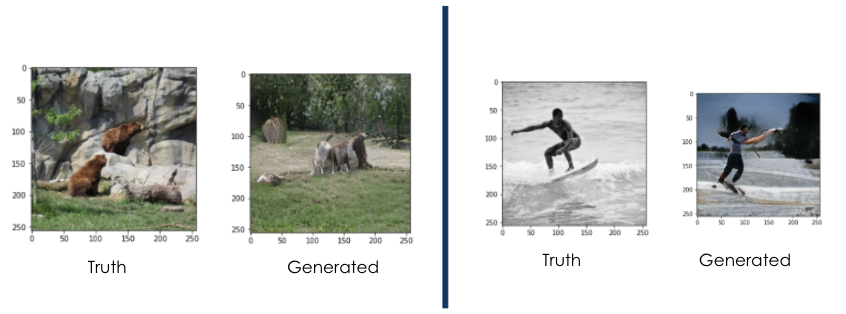
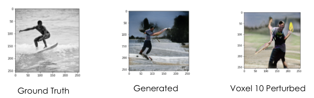

# Update 3
So far, our team has been focused on coding our model in which fMRI activity can be reconstructed into the original visual stimulus image.  Currently, we are working on an encoder that can map the fMRI vectors to the CLIP space. This will allow us to generate an image using LAFITE’s pre-trained model which maps from the CLIP space to the image space. We also modified the StyleGAN2 architecture in order to be optimized for taking in fMRI inputs. This includes adjusting components such as the loss function and optimizing the input noise vector. 
|  | 
|:--:| 
| *Figure 1. Model Process*|

The figures below illustrate the ground truth image juxtaposed with the image generated by our current model. 
|  | 
|:--:| 
| *Figure 2. Ground Truths vs Sample Outputs*|

******

## Joint Embedding Models

For us, the goal of using Joint Embedding Models is to learn a shared feature between two modalities, such that we can have two encoders map to the same general region. In our case, this would be the text and image encoder that we use in CLIP. Since we have a multitude of image and text pairs, the point of our model is to try to maximize the similarity between the output vectors of the encoded pairs. This also applies in the reverse as well, as we implement contrastive learning. If we only have positive samples during training, our model will “collapse,” as all of our outputs will be very similar. Thus, we also want to have contrastive pairs, where we minimize the similarity between these dissimilar pairs. Being able to learn this shared space would help with feature extraction for downstream tasks such as image caption generation. 

|  | 
|:--:| 
| *Figure 3. Joint Embedding Model*|

******

## "Leave One Out" Approach

By utilizing the “Leave one out” approach, we can perturb the activity for a single voxel and see how that creates any change in the generated image. However, this is highly dependent on LAFITE, and leave one out approaches have been shown to be not so great for these types of tasks. In theory, this approach could lead to better understanding of how each ‘voxel’ affects the image produced. However, features learned are not generally one to one, meaning that preturbing one voxel significantly affects the production of the entire image, and much more than ‘one’ feature will be lost in the reconstruction of the image.

|  | 
|:--:| 
| *Figure 4.  Leave One Out Approach Sample Output*|

******

## Future Tasks/Work:

Up to this point, we have been using the general dataset given to us by the NSD dataset, but we are now looking to explore new raw data to create a more interesting dataset. More specifically, we are looking at different groups of ROIs. The one we used before was NSD-general, but under the guidance of our sponsor, we are looking into ones that focus specifically on the groups of visual cortices. 

Another concept that we are exploring is self-supervised learning. For this, we will have a ‘student’ and ‘teacher’ model, of which both are the same. They are each fed a separate crop of the image, where the teacher obtains a centered version. The student then learns from a predefined contrastive loss based on the difference between the teacher and student models. The student then has its model weights adjusted, and these adjustments are ‘exponentialized’/go through another function to update the weights of the teacher model.

|  | 
|:--:| 
| *Figure 5.  Example of Self-Supervised Learning Process* [1]|

******

## References
[1]  **[Advancing the state of the art in computer vision with self-supervised Transformers and 10x more efficient training](https://ai.facebook.com/blog/dino-paws-computer-vision-with-self-supervised-transformers-and-10x-more-efficient-training/)**
